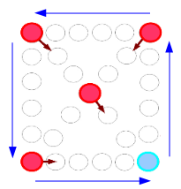
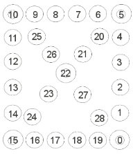

## 문제

윷놀이는 명절에 즐기는 한국의 민속놀이로 반달 모양의 가락(윷)을 던져서 말을 움직여 노는 말판 놀이이다. 두 팀이 각각 말을 가지고 윷을 교대로 던져 결승점에 말을 모두 통과시키는 팀이 이기는 놀이이다. **윷놀이의 룰은 지역마다 다를 수 있으므로 여기서는 아래에 기재된 룰에 의해 진행된다고 가정한다.**

* 도(Do): 앞으로 한 칸 움직인다.
* 개(Gae): 앞으로 두 칸 움직인다.
* 걸(Gul): 앞으로 세 칸 움직인다.
* 윷(Yut): 앞으로 네 칸 움직이고, 윷을 한 번 더 던진다.
* 모(Mo): 앞으로 다섯 칸 움직이고, 윷을 한 번 더 던진다.

윷을 던져 나오는 위의 5가지 경우에 따라서 말을 이동시킨다. 말을 이동시킬 때는 이동 가능한 말 중 임의의 1개를 골라 이동시킨다. 자신의 말이 자신의 다른 말과 같은 위치에 도달했을 때 업기라고 하여 다음 이동부터는 같이 이동한다. 만약 자신의 말이 다른 팀의 말이 있는 위치에 있는 경우 해당 말을 탈락시키고 윷을 다시 던져야 한다. 탈락한 말은 다시 처음부터 출발해야 한다. 단, 윷이나 모로 잡았을 때 두 번 던지는 것이 아니라 한 번 던질 수 있다. 윷을 던져 나온 순서대로 말을 이동시켜야 하므로, 모를 던진 후 걸이 나왔을 때 세 칸을 먼저 이동하고 다섯 칸을 다음에 이동하는 것은 불가능하다.

    

말은 출발지인 0번 지점에서부터 출발하여 결승점인 0번 지점을 지나치는 경로로 이동한다. 말은 말판의 외곽을 따라서 움직이며, 빨간 점으로 표시된 부분에 말이 멈췄을 때 빠른 길로 이동한다. 최초의 말은 말판 위에 있지 않으므로 윷을 던져 말판에 올려놓기 전에는 잡을 수 없다. 또한, 결승점을 완전히 지나쳐야 말을 통과시킨 것으로 인정되므로 19번 위치에서 말을 통과시키기 위해서는 두 칸 이상 이동해야 한다. 한 칸을 움직이게 되면 0번 지점에 있게 되고, 다른 말에 의해 탈락될 수 있다. 결승점을 통과한 말은 다시 사용할 수 없으며, 모든 말이 통과하는 순간 그 팀이 승리하게 되며 경기는 중단된다. 마지막에 윷이나 모를 던져서 승리를 했더라도 게임이 중단된 후에는 더이상 던지지 않는다.

용이네 가족은 명절을 맞이하여 A 팀과 B 팀으로 나누어 윷놀이를 하고 있었다. A 팀부터 먼저 시작하기로 했다. 그들은 선의의 경쟁을 펼치고 있었기 때문에, 종이에 어떤 팀이 무슨 어떻게 윷을 던졌는지 여부를(A: 도, B: 개, ...) 순서대로 모두 적어놓았다.

저녁식사 시간이 다 되었고, 게임이 진행중이거나 막 끝난 상황이었다. 그런데 불행히도 강아지 퍼피가 말판을 지나다니면서 흐트려트려 놓아 말판이 제대로 유지되었는지 확신할 수 없게 되었다. (출발하지 않은 말과 결승점을 통과한 말은 영향을 받지 않았다) 게다가 퍼피는 종이에서 각 윷을 던진 팀이 누구인지에 대한 정보도 모두 물어가 버렸다! 기억을 더듬어 말판을 복구하였지만, 이것이 종이에 기록된 던진 윷의 전체 목록과 순서에 맞는 말판 상태인지에 대해 확신이 없다. 이 작업은 너무 복잡하여 용이의 힘으로는 쉽지 않아 여러분에게 도움을 청하기로 했다. 용이의 고민을 해결해주자.

## 입력

입력의 첫 줄에는 테스트 케이스의 숫자 **T**가 주어진다.  
각 테스트 케이스는 다음과 같이 주어진다.

```

U N A B
윷0 ... 윷N-1
말A0 ... 말AA-1
말B0 ... 말BB-1
```

각 케이스의 첫 줄에는 다음과 같이 정수 4개가 주어진다. **U**는 한 팀에서 사용가능한 말의 수, **N**는 던져진 윷의 목록 개수이다. 그리고 **A**는 판 위에 놓여 있는 A팀 말의 개수이고, **B**는 판 위에 놓여 있는 B팀 말의 개수이다.  
다음 줄에는 공백으로 분리되어 있는 던져진 윷의 목록이 들어온다.  
그 다음 두 줄에는 각각 A팀과 B팀의 말의 위치가 공백으로 분리되어 들어온다.

### 제한

* 1 ≤ **T** ≤ 50.
* 0 ≤ **A**, **B** ≤ **U**.
* 0 ≤ **말x** ≤ 28.
* 1 ≤ **N** ≤ 50.
* 1 ≤ **U** ≤ 2.

## 출력

각 테스트 케이스에 대한 출력은 "Case #x: y" 형태로 이루어져야 한다. x는 1부터 시작되는 케이스 번호이고, y는 검증 결과이다. 만약 주어진 데이터로 만들어질 수 있는 윷놀이 판이라면 "YES"를 그렇지 않다면 "NO"를 출력한다.
