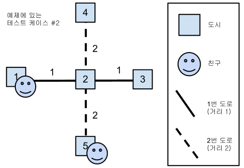

## 문제

서로 다른 도시에 사는 친구들이 급히 약속장소를 정하려고 한다. 하지만 길이 너무 복잡하고 서로 멀리 살아서, 어느 정도 시간 여유를 잡아야 할지 알아내기가 어렵다. 친구들이 한 곳에서 만나는 데 걸리는 최소한의 시간은 얼마인가?

약속장소를 잡기 위해 펼친 지도에는 도시와 각 도시를 잇는 도로에 대한 정보가 있다. 이것은 두 도시를 연결하는 길을 의미하는 것이 아니라, 연속된 길들의 집합으로서 여러 도시를 지나간다.

더욱 자세히 말하면, 각각의 **T** 개의 테스트 케이스에 대해 다음과 같은 것이 주어진다.

* **N**: 도시의 숫자
* **P**: 친구의 수
* **M**: 도로의 숫자

각 도시는 순서대로 **1**부터 **N**까지의 번호가 붙여져 있다.

또한, **1**부터 **P**까지의 번호가 붙여져 있는 각 친구 **i**에 대해, 다음과 같은 것이 주어진다.

* **Xi**: 친구가 출발하는 도시의 번호.
* **Vi**: 친구가 거리 1 만큼 움직이는 데 걸리는 시간.

각 도시를 잇는 도로 **j**에 대해서는 다음과 같은 것이 주어진다. 도로는 단순히 두 도시를 잇는 길이 아니라, 여러 도시를 순서대로 잇는 연속된 길의 모임이다.

* **Dj**: 도로가 지나가는 도시들 사이의 거리. (한 도로 위에서, 인접한 도시 사이의 거리는 **Dj**로 같다.)
* **Lj**: 도로가 지나가는 도시들의 숫자
* **{Cj,k}**: 도로가 이어주는 도시의 번호가 순서대로 나열된다.

위의 정보들을 이용해서, 동시에 출발한 친구들이 한 도시에서 만나는 데 필요한 최소한의 시간을 구하시오. 만약 다들 모일 수 있는 도시가 없다면 '-1'을 대신 출력하시오.

모임은 도시에서만 이루어질 수 있으며, 먼저 도착한 친구들은 다른 친구들을 기다릴 수 있다.

두 도시를 바로 연결하는 도로는 둘 이상 존재할 수 없으며, 어떤 도시에 도착하였을 때, 해당 도시를 지나는 도로 간의 이동은 추가 시간 없이 자유로이 할 수 있다.

## 입력

입력은 다음과 같은 형식으로 주어진다.

T  
N P M  
X1 V1  
X2 V2  
...  
XP VP  
D1 L1 C1,1 C1,2 ... C1,L1  
D2 L2 C2,1 C2,2 ... C2,L2  
...  
DM LM CM,1 CM,2 ... CM,LM  
N' P' M'  
....

### 제한

* 각 테스트 케이스에 대한 답은 2147483647 이하이다.
* 1 ≤ **T** ≤ 30.
* 1 ≤ **Vi** ≤ 200.
* 1 ≤ **Di** ≤ 200.
* 2 ≤ **Lj** ≤ **N**.
* 1 ≤ **N** ≤ 10000.
* 2 ≤ **P** ≤ 100.
* 1 ≤ **M** ≤ 1000.
* 2 ≤ **Lj**≤ 150.

## 출력

각각의 테스트 케이스에 대해서, x가 1번부터 시작하는 케이스 번호라고 하고 y가 각 케이스에 해당하는 답이라고 할 때 출력 파일의 각 줄에 "Case #x: y"와 같은 형식으로 출력한다. 친구들이 한 도시에서 만나는 것이 불가능하다면, 최소 시간 대신 '-1'을 출력한다.

## 힌트

