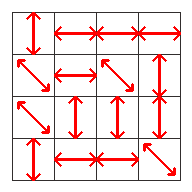
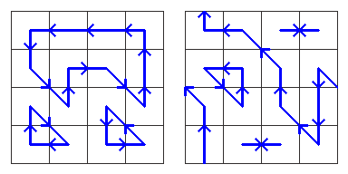

## 문제

Have you ever been to the Google Lemming Factory? It is a very unusual place. The floor is arranged into an **R** x **C** grid. Within each grid square, there is a conveyor belt oriented up-down, left-right, or along one of the two diagonals. The conveyor belts move either forwards or backwards along their orientations, and you can independently choose which of the two possible directions each conveyor belt should move in.

Currently, there is a single lemming standing at the center of each square. When you start the conveyor belts, each lemming will move in the direction of the conveyor belt he is on until he reaches the center of a new square. All these movements happen simultaneously and take exactly one second to complete. Afterwards, the lemmings will all be on new squares, and the process will repeat from their new positions. This continues forever, or at least until you turn off the conveyor belts.

* When a lemming enters a new square, he continues going in the direction he was already going until he reaches the center of that square. He will not be affected by the new conveyor belt until the next second starts.
* If a lemming moves off the edge of the grid, he comes back at the same position on the opposite side. For example, if he were to move diagonally up and left from the top-left square, he would arrive at the bottom-right square. By the miracle of science, this whole process still only takes 1 second.
* Lemmings never collide and can always move past each other without difficulty.

The trick is to choose directions for each conveyor belt so that the lemmings will keep moving forever without ever having two of them end up in the center of the same square at the same time. If that happened, they would be stuck together from then on, and that is not as fun for them.

Here are two ways of assigning directions to each conveyor belt from the earlier example:

In both cases, we avoid ever sending two lemmings to the center of the same square at the same time.

Given an arbitrary floor layout, calculate **N**, the number of ways to choose directions for each conveyor belt so that no two lemmings will ever end up in the center of the same square at the same time. The answer might be quite large, so please output it modulo 1000003.

## 입력

The first line of input gives the number of test cases, **T**. **T** test cases follow. Each begins with a line containing positive integers **R** and **C**.

This is followed by **R** lines, each containing a string of **C** characters chosen from `"|-/\"`. Each character represents the orientation of the conveyor belt in a single square:

* '`|`' represents a conveyor belt that can move up or down.
* '`-`' represents a conveyor belt that can move left or right.
* '`/`' represents a conveyor belt that can move up-right or down-left.
* '`\`' represents a conveyor belt that can move up-left or down-right.

### Limits

* 1 ≤ **T** ≤ 25.
* 3 ≤ **R** ≤ 100.
* 3 ≤ **C** ≤ 100.

## 출력

For each test case, output one line containing "Case #x: **M**", where x is the case number (starting from 1), and **M** is the remainder when dividing **N** by 1000003.
