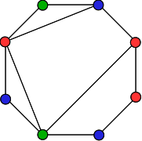

## 문제

You have recently adopted some kittens, and now you want to make a house for them. On the outside, the house will be shaped like a convex polygon with **N** vertices. On the inside, it will be divided into several rooms by **M** interior walls connecting vertices along straight lines. No two walls will ever cross, but there might be multiple walls touching a single vertex.

So why is your house of kittens going to be so special? At every vertex, you are going to build a pillar entirely out of catnip! Kittens will be able to play with any pillar that touches the room they are in, giving them a true luxury home.

To make the house even more exciting, you want to use different flavors of catnip. A single pillar can only use one flavor, but different pillars can use different flavors. There is only one problem. If some room does not have access to *all* the catnip flavors in the house, then the kittens in that room will feel left out and be sad.

Your task is to choose what flavor of catnip to use for each vertex in such a way that (a) every flavor is accessible from every room, and (b) as many flavors as possible are used.

In the following example, three different flavors (represented by red, green, and blue dots) are distributed across an 8-sided house while keeping the kittens in every room happy:

In the image above, starting at the left corner of the top wall and going clockwise, the colors here are: green, blue, red, red, blue, green, blue, red.

## 입력

The first line of the input gives the number of test cases, **T**. **T** test cases follow.

Each test case consists of three lines. The first line gives **N** and **M**, the number of vertices and interior walls in your cat house. The second lines gives space-separated integers **U**1, **U**2, ..., **UM** describing where each interior wall begins. The third lines gives space-separated integers **V**1, **V**2, ..., **VM** describing where each interior wall ends.

More precisely, if the vertices of your cat house are labeled 1, 2, ..., **N** in clockwise order, then the interior walls are between vertices **U**1 and **V**1, **U**2 and **V**2, etc.

### Limits

* 1 ≤ **T** ≤ 100.
* 1 ≤ **M** ≤ **N** - 3.
* 1 ≤ **U**i < **V**i ≤ **N** for all i.
* Interior walls do not touch each other except at the **N** vertices.
* Interior walls do not touch the outside of the house except at the **N** vertices.
* 4 ≤ **N** ≤ 2000.

## 출력

For each test case, output two lines. The first should be "Case #x: C", where x is the case number, and C is the maximum number of catnip flavors that can be used. The second line should contain **N** space-separated integers: "y1 y2 ... y**N**", where yi is an integer between 1 and C indicating which catnip flavor you assigned to vertex i.

If there are multiple assignments with C flavors, you may output any of them.
