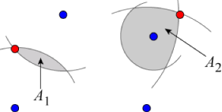

## 문제

Farmer John has recently acquired a nice herd of **N** goats for his field. Each goat `i` will be tied to a pole at some position **P**i using a rope of length **L**i. This means that the goat will be able to travel anywhere in the field that is within distance **L**i of the point **P**i, but nowhere else. (The field is large and flat, so you can think of it as an infinite two-dimensional plane.)

Farmer John already has the pole positions picked out from his last herd of goats, but he has to choose the rope lengths. There are two factors that make this decision tricky:

* The goats all need to be able to reach a single water bucket. Farmer John has not yet decided where to place this bucket. He has reduced the choice to a set of positions {**Q**1, **Q**2, ..., **Q**M}, but he is not sure which one to use.
* The goats are ill-tempered, and when they get together, they sometimes get in noisy fights. For everyone's peace of mind, Farmer John wants to minimize the area **A** that can be reached by all the goats.

Unfortunately, Farmer John is not very good at geometry, and he needs your help for this part!

For each bucket position **Q**j, you should choose rope lengths so as to minimize the area **A**jthat can be reached by every goat when the bucket is located at position **Q**j. You should then calculate each of these areas **A**j.

### Example

In the picture below, there are four blue points, corresponding to the pole positions: **P**1, **P**2, **P**3, and **P**4. There are also two red points, corresponding to the potential bucket positions: **Q**1 and **Q**2. You need to calculate **A**1 and **A**2, the areas of the two shaded regions.

   

## 입력

The first line of the input gives the number of test cases, **T**. **T** test cases follow. Each test case begins with a line containing the integers **N** and **M**.

The next **N** lines contain the positions **P**1, **P**2, ..., **P**N, one per line. This is followed by **M**lines, containing the positions **Q**1, **Q**2, ..., **Q**M, one per line.

Each of these **N** + **M** lines contains the corresponding position's **x** and **y** coordinates, separated by a single space.

### Limits

* All coordinates are integers between -10,000 and 10,000.
* The positions **P**1, **P**2, ..., **P**N, **Q**1, **Q**2, ..., **Q**M are all distinct and no three are collinear.
* 1 ≤ **T** ≤ 100.
* **N** = 2.
* 1 ≤ **M** ≤ 10.

## 출력

For each test case, output one line containing "Case #x: **A**1 **A**2 ... **A**M", where x is the case number (starting from 1), and **A**1 **A**2 ... **A**M are the values defined above. Answers with a relative or absolute error of at most 10-6 will be considered correct.
