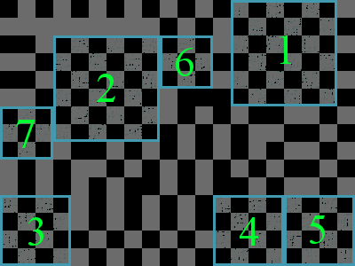

## 문제

The chess board industry has fallen on hard times and needs your help. It is a little-known fact that chess boards are made from the bark of the extremely rare Croatian Chess Board tree, (*Biggus Mobydiccus*). The bark of that tree is stripped and unwrapped into a huge rectangular sheet of chess board material. The rectangle is a grid of black and white squares.

Your task is to make as many large square chess boards as possible. A chess board is a piece of the bark that is a square, with sides parallel to the sides of the bark rectangle, with cells colored in the pattern of a chess board (no two cells of the same color can share an edge).

Each time you cut out a chess board, you must choose the largest possible chess board left in the sheet. If there are several such boards, pick the topmost one. If there is still a tie, pick the leftmost one. Continue cutting out chess boards until there is no bark left. You may need to go as far as cutting out 1-by-1 mini chess boards.

Here is an example showing the bark of a Chess Board tree and the first few chess boards that will be cut out of it.

## 입력

The first line of the input gives the number of test cases, **T**.  **T** test cases follow. Each one starts with a line containing the dimensions of the bark grid, **M** and **N**. **N** will always be a multiple of 4. The next **M** lines will each contain an (**N**/4)-character hexadecimal integer, representing a row of the bark grid. The binary representation of these integers will give you a strings of **N** bits, one for each row. Zeros represent black squares; ones represent white squares of the grid. The rows are given in the input from top to bottom. In each row, the most-significant bit of the hexadecimal integer corresponds to the leftmost cell in that row.

### Limits

* 1 ≤ **T** ≤ 100;
* **N** will be divisible by 4;
* Each hexadecimal integer will contain exactly **N**/4 characters.
* Only the characters 0-9 and A-F will be used.
* 1 ≤ **M** ≤ 32;
* 1 ≤ **N** ≤ 32.

## 출력

For each test case, output one line containing "Case #x: **K**", where x is the case number (starting from 1) and **K** is the number of different chess board sizes that you can cut out by following the procedure described above. The next **K** lines should contain two integers each -- the size of the chess board (from largest to smallest) and the number of chess boards of that size that you can cut out.

## 힌트

The first example test case represents the image above.
