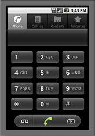

## 문제

The Latin alphabet contains 26 characters and telephones only have ten digits on the keypad. We would like to make it easier to write a message to your friend using a sequence of keypresses to indicate the desired characters. The letters are mapped onto the digits as shown below. To insert the character `B` for instance, the program would press `22`. In order to insert two characters in sequence from the same key, the user must pause before pressing the key a second time. The space character `' '` should be printed to indicate a pause. For example, `2 2` indicates `AA` whereas `22` indicates `B`.



## 입력

The first line of input gives the number of cases, **N**. **N** test cases follow. Each case is a line of text formatted as

```

desired_message
```

Each message will consist of only lowercase characters `a-z` and space characters `' '`. Pressing zero emits a space.

Limits

* 1 ≤ **N** ≤ 100.
* 1 ≤ length of message in characters ≤ 15.

## 출력

For each test case, output one line containing "Case #**x**: " followed by the message translated into the sequence of keypresses.
