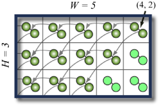

## 문제

A large room is filled with mousetraps, arranged in a grid. Each mousetrap is loaded with two ping-pong balls, carefully placed so that when the mousetrap goes off they will be flung, land on other mousetraps and set them off. The walls of the room are sticky, so any balls that hit the walls of the room are effectively absorbed.

Every mousetrap that gets hit sends the two ping-pong balls in the same way: their movement is determined by a X and Y displacement relative to the launching mousetrap. You then decide to launch a single ping-pong ball into the room. It hits a mousetrap, setting it off, and launching its two balls. These two balls then set off two more mousetraps, and now four balls fly off... When the dust settles, many of the mousetraps have been set off, but some have been missed by all the flying balls.

You need to calculate how many mousetraps will be set off.

As an example (see the first sample test case), the picture below illustrates a room with width 5, height 3. The two directions for the ping-pong balls in each room are (-1, 0) and (-1, -1), respectively. The first ball you launch hits the mousetrap at the position (4, 2). In the end, 12 mousetraps are triggered.

## 입력

The first line of input gives the number of cases, **C**. **C** test cases follow. Each case contains four lines. The first line is the size of the grid of mousetraps (equal to the size of the room), given as its width **W** and height **H**. The next two lines give the destinations of the two ping-pong balls, as an X and Y displacement. For example, if the two lines were `0 1` and `1 1`, then triggering a mousetrap would launch two balls; one would hit the mousetrap just up from the triggered mousetrap, and the other would hit the mousetrap that is up and to the right of the triggered mousetrap. The final line has two integers specifying, respectively, the column and row of the mousetrap set off by the original ping-pong ball (where 0 0 would be the bottom left mousetrap).

Limits

* 1 ≤ **C** ≤ 100
* -20 ≤ any displacement ≤ 20
* Neither vector will have zero length.
* 2 ≤ **W**, **H** ≤ 1000000

## 출력

For each test case, output one line containing "Case #**A**: **B**", where **A** is 1-based number of the case and **B** is the number of mousetraps that are triggered (including the first one).
