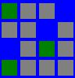
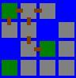
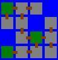

## 문제

The king wants bridges built and he wants them built as quickly as possible. The king owns an **N** by **M** grid of land with each cell separated from its adjacent cells by a river running between them and he wants you to figure out how many man-hours of work it will take to build enough bridges to connect every island. Some cells are actually lakes and need not have a bridge built to them.

Some of the islands are forests where trees are abundant. Located in the top left corner is the *base camp*, which is always a forest.

A bridge can only be built between two islands if they are vertically or horizontally adjacent, and one of the islands is accessible from the base camp through the bridges that are already built.

The number of man-hours it takes to build a bridge is the number of bridges the builders have to cross to get from the nearest forest to the island you're building to, including the bridge being built. Builders can only walk between two islands if there is already a bridge between them.

The king has already ensured that there is at least one way to connect all the islands.

Write a program that, given a map of the islands, will output the minimum number of man-hours required to connect all islands.

Consider this example. A green tile indicates a forest, gray indicates an empty island, and blue indicates water.

One optimal solution starts out by building the following bridges from the base camp forest.

This has a cost of 1 + 2 + 1 + 2 + 3 + 4 = 13

Now since the forest at row 3, column 3 is connected to base camp, we can build bridges from there. One optimal solution connects the rest of the islands with bridges built from this forest.

This has a cost of 2 + 1 + 2 + 1 + 2 + 3 = 11. This brings the total cost to 24 which is the optimal solution.

## 입력

The first line of the input contains an integer **T**, the number of test cases.  **T** test cases follow. Each test case will begin with **N**, the number of rows, and **M**, the number of columns, on one line separated by a space.  **N** rows follow that contain exactly **M**characters each. A 'T' indicates an island with a forest, a '#' indicates an island, and a '.' indicates water.

Limits

* 1 ≤ **T** ≤ 50
* 2 ≤ **N** ≤ 30
* 2 ≤ **M** ≤ 30
* The top left cell will always be a 'T'
* It will be possible to connect all islands through bridges
* There will be at most 2 forests in the grid including the base camp.

## 출력

A single line containing "Case #X: Y", where **X** is the 1-based case number, and **Y** is the minimum number of man-hours needed to connect all islands.
