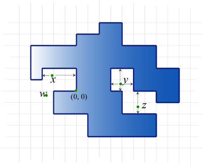
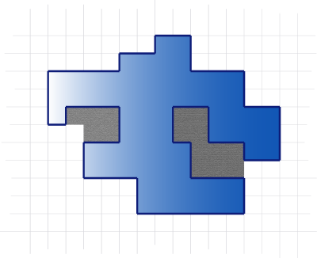
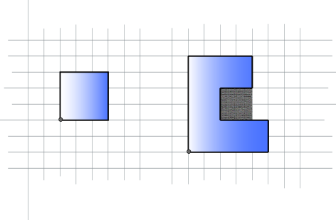

## 문제

Professor Polygonovich, an honest citizen of Flatland, likes to take random walks along integer points in the plane. He starts from the origin in the morning, facing north. There are three types of actions he makes:

* 'F': move forward one unit of length.
* 'L': turn left 90 degrees.
* 'R': turn right 90 degrees.

At the end of the day (yes, it is a long walk!), he returns to the origin. He never visits the same point twice except for the origin, so his path encloses a polygon. In the following picture the interior of the polygon is colored blue (ignore the points x, y, z, and w for now; they will be explained soon):



Notice that as long as Professor Polygonovich makes more than 4 turns, the polygon is not convex. So there are pockets in it.

**Warning!** To make your task more difficult, our definition of *pockets* might be different from what you may have heard before.

The gray area below indicates pockets of the polygon.



Formally, a point **p** is said to be in a pocket if it is not inside the polygon, and at least one of the following two conditions holds.

* There are boundary points directly both east and west of **p**; or
* There are boundary points directly both north and south of **p**.

Boundary points are the points traversed by Mr. Poligonovich on his walk (these include all points, not just those with integer coordinates).

Consider again the first picture from above. Point **x** satisfies the first condition; **y** satisfies both; **z** satisfies the second one. All three points are in pockets. The point **w** is not in a pocket.

Given Polygonovich's walk, your job is to find the total area of the pockets.

## 입력

The first line of input gives the number of cases, **N**. **N** test cases follow.

Each test case has the description of one walk of Professor Polygonovich. It starts with an integer **L**. Following are **L** "**S** **T**" pairs, where **S** is a string consisting of 'L', 'R', and 'F' characters, and **T** is an integer indicating how many times **S** is repeated.

In other words, the input for one test case looks like this:

```

S1 T1 S2 T2 ... SL TL
```

The actions taken are the concatenation of T1 copies of S1, followed by T2 copies of S2, and so on.

The "**S** **T**" pairs for a single test case may not all be on the same line, but the strings **S** will not be split across multiple lines. The second example below demonstrates this.

Limits

* 1 ≤ **N** ≤ 100
* 1 ≤ **T** (bounded from above by constraints in the problem statement, "Small dataset" and "Large dataset" sections)
* The path, when concatenated from the input strings, will not have two consecutive direction changes (that is, there will be no 'LL', 'RR', 'LR', nor 'RL' in the concatenated path). There will be at least one 'F' in the path.
* The path described will not intersect itself, except at the end, and it will end back at the origin.
* 1 ≤ **L** ≤ 1000
* The length of each string **S** will be between 1 and 32, inclusive.
* The professor will not visit any point with a coordinate bigger than 3000 in absolute value.

## 출력

For each test case, output one line containing "Case #**X**: **Y**", where **X** is the 1-based case number, and **Y** is the total area of all pockets.

## 힌트

The following picture illustrates the two sample test cases.


