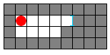
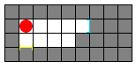
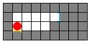
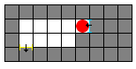
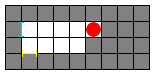

## 문제

PortalTM is a first-person puzzle/platform game developed and published by Valve Software. The idea of the game was to create two portals on walls and then jump through one portal and come out the other. This problem has a similar idea but it does not assume you have played Portal.

For this problem you find yourself in a **R** by **C** grid. Additionally there is a delicious cake somewhere else in the grid. You're very hungry and wish to arrive at the cake with as few moves as possible. You can move north, south, east or west to an empty cell. Additionally, you have the ability to create portals on walls.

To help you get to the cake you have a portal gun which can shoot two types of portals, a yellow portal and a blue portal. A portal is created by shooting your portal gun either north, south, east or west. This emits a ball of energy that creates a portal on the first wall it hits. Note that for this problem shooting the portal gun does not count as a move. If you fire your portal gun at the cake, the energy ball will go right through it.

After creating a yellow portal and a blue portal, you can move through the yellow portal to arrive at the blue portal or vice versa. Using these portals you may be able to reach the cake even faster! You can only use portals after you create both a yellow and a blue portal.

Consider the following grid:

Gray cells represent walls, white cells represent empty cells, and the red circle indicates your position.

Suppose you shoot a blue portal east. The portal is created on the first wall it hits, resulting in:

Now suppose you shoot a yellow portal south:  

Next you move south once:

Now comes the interesting part. If you move south one more time you go through the yellow portal to the blue portal:

There can only be one yellow portal and one blue portal at any time. For example if you attempt to create a blue portal to the west the other blue portal will disappear:

A portal disappears only when another portal of the same color is fired.

Note that the portals are created on one side of the wall. If a wall has a portal on its east side you must move into the wall from the east to go through the portal. Otherwise you'll be moving into a wall, which is improbable.

Finally, you may not put two portals on top of each other. If you try to fire a portal at a side of a wall that already has a portal, the second portal will fail to form.

Given the maze, your initial position, and the cake's position, you want to find the minimum number of moves needed to reach the cake if it is possible. Remember that shooting the portal gun does not count as a move.

## 입력

The first line of input gives the number of cases, **N**. **N** test cases follow.

The first line of each test case will contain the integers **R** and **C** separated by a space.  **R**lines follow containing **C** characters each, representing the map:

* `.` indicates an empty cell;
* `#` indicates a wall;
* `O` indicates your starting position; and
* `X` indicates the cake's position.

There will be exactly one `O` and one `X` character per case.

Cells outside of the grid are all walls and you may use them to create portals.

Limits

* **N** = 50
* 1 <= **R**, **C** <= 15

## 출력

For each test case you should output one line containing "Case #**X**: **Y**" (quotes for clarity) where **X** is the number of the test case and **Y** is the minimum number of moves needed to reach the cake or "THE CAKE IS A LIE" (quotes for clarity) if the cake cannot be reached.

## 힌트

Here is the sequence of moves for the first case (note that shooting the portal gun does not count as a move):

1. Move one step east.
2. Shoot a blue portal north.
3. Shoot a yellow portal south.
4. Move one step north through the blue portal.
5. Shoot a blue portal east.
6. Move one step south through the yellow portal.
7. Move one step west.
8. Eat your delicious and moist cake.

PortalTM is a trademark of Valve Inc. Valve Inc. does not endorse and has no involvement with Google Code Jam.
