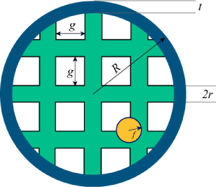

## 문제

What are your chances of hitting a fly with a tennis racquet?

To start with, ignore the racquet's handle. Assume the racquet is a perfect ring, of outer radius **R** and thickness **t** (so the inner radius of the ring is **R**−**t**).

The ring is covered with horizontal and vertical strings. Each string is a cylinder of radius **r**. Each string is a chord of the ring (a straight line connecting two points of the circle). There is a gap of length **g** between neighbouring strings. The strings are symmetric with respect to the center of the racquet i.e. there is a pair of strings whose centers meet at the center of the ring.

The fly is a sphere of radius **f**. Assume that the racquet is moving in a straight line perpendicular to the plane of the ring. Assume also that the fly's center is inside the outer radius of the racquet and is equally likely to be anywhere within that radius. Any overlap between the fly and the racquet (the ring or a string) counts as a hit.

## 입력

One line containing an integer **N**, the number of test cases in the input file.

The next **N** lines will each contain the numbers **f**, **R**, **t**, **r** and **g** separated by exactly one space. Also the numbers will have at most 6 digits after the decimal point.

- Limits

* **f**, **R**, **t**, **r** and **g** will be positive and smaller or equal to 10000.
* **t** < **R**
* **f** < **R**
* **r** < **R**
* 1 ≤ **N** ≤ 30
* The total number of strings will be at most 60 (so at most 30 in each direction).

## 출력

**N** lines, each of the form "Case #**k**: **P**", where **k** is the number of the test case and **P** is the probability of hitting the fly with a piece of the racquet.

Answers with a relative or absolute error of at most 10-6 will be considered correct.
