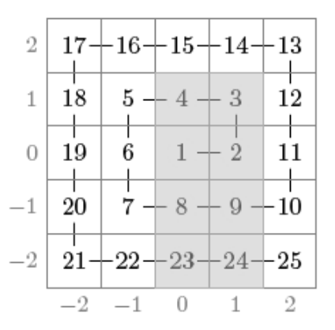

## 문제

A grid of size (2n + 1) × (2n + 1) has been constructed as follows. Number 1 has been placed in the center square, number 2 has been placed to the right of it, and the following numbers have been placed along the spiral counterclockwise.

Your task is to calculate answers for q queries where the sum of numbers in an rectangular region in the grid is requested (modulo 109 + 7). For example, in the following grid n = 2 and the sum of numbers in the gray region is 74:

## 입력

The first input line contains two integers n and q: the size of the grid and the number of queries.

After this, there are q lines, each containing four integers x1, y1, x2 and y2 (-n ≤ x1 ≤ x2 ≤ n, -n ≤ y1 ≤ y2 ≤ n). This means that you should calculate the sum of numbers in a rectangular region with corners (x1, y1) and (x2, y2).

## 출력

You should output the answer for each query (modulo 109 + 7).
