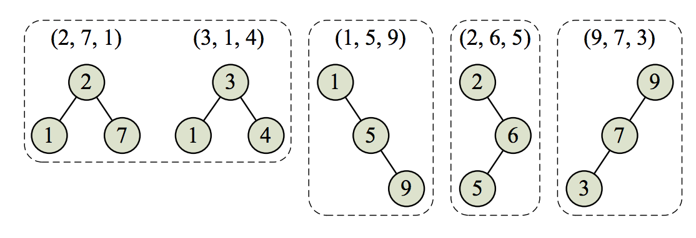

## 문제

Advanced Ceiling Manufacturers (ACM) is analyzing the properties of its new series of Incredibly Collapse-Proof Ceilings (ICPCs). An ICPC consists of n layers of material, each with a different value of collapse resistance (measured as a positive integer). The analysis ACM wants to run will take the collapse-resistance values of the layers, store them in a binary search tree, and check whether the shape of this tree in any way correlates with the quality of the whole construction. Because, well, why should it not?

To be precise, ACM takes the collapse-resistance values for the layers, ordered from the top layer to the bottom layer, and inserts them one-by-one into a tree. The rules for inserting a value v are:

* If the tree is empty, make v the root of the tree.
* If the tree is not empty, compare v with the root of the tree. If v is smaller, insert v into the left subtree of the root, otherwise insert v into the right subtree.

ACM has a set of ceiling prototypes it wants to analyze by trying to collapse them. It wants to take each group of ceiling prototypes that have trees of the same shape and analyze them together.

For example, assume ACM is considering five ceiling prototypes with three layers each, as described by Sample Input 1 and shown in Figure C.1. Notice that the first prototype’s top layer has collapseresistance value 2, the middle layer has value 7, and the bottom layer has value 1. The second prototype has layers with collapse-resistance values of 3, 1, and 4 – and yet these two prototypes induce the same tree shape, so ACM will analyze them together.

Given a set of prototypes, your task is to determine how many different tree shapes they induce.

Figure C.1: The four tree shapes induced by the ceiling prototypes in Sample Input 1.

## 입력

The first line of the input contains two integers n (1 ≤ n ≤ 50), which is the number of ceiling prototypes to analyze, and k (1 ≤ k ≤ 20), which is the number of layers in each of the prototypes.

The next n lines describe the ceiling prototypes. Each of these lines contains k distinct integers (between 1 and 106, inclusive), which are the collapse-resistance values of the layers in a ceiling prototype, ordered from top to bottom.

## 출력

Display the number of different tree shapes.
