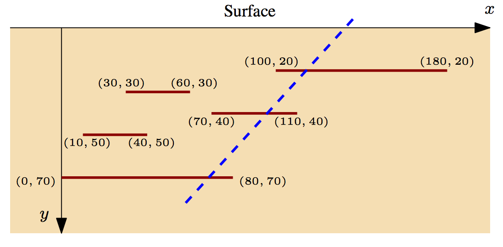

## 문제

A large part of the world economy depends on oil, which is why research into new methods for finding and extracting oil is still active. Profits of oil companies depend in part on how efficiently they can drill for oil. The International Crude Petroleum Consortium (ICPC) hopes that extensive computer simulations will make it easier to determine how to drill oil wells in the best possible way.

Drilling oil wells optimally is getting harder each day – the newly discovered oil deposits often do not form a single body, but are split into many parts. The ICPC is currently concerned with stratified deposits, as illustrated in Figure G.1.

Figure G.1: Oil layers buried in the earth. This figure corresponds to Sample Input 1.

To simplify its analysis, the ICPC considers only the 2-dimensional case, where oil deposits are modeled as horizontal line segments parallel to the earth’s surface. The ICPC wants to know how to place a single oil well to extract the maximum amount of oil. The oil well is drilled from the surface along a straight line and can extract oil from all deposits that it intersects on its way down, even if the intersection is at an endpoint of a deposit. One such well is shown as a dashed line in Figure G.1, hitting three deposits. In this simple model the amount of oil contained in a deposit is equal to the width of the deposit. Can you help the ICPC determine the maximum amount of oil that can be extracted by a single well?

## 입력

The first line of input contains a single integer n (1 ≤ n ≤ 2 000), which is the number of oil deposits. This is followed by n lines, each describing a single deposit. These lines contain three integers x0, x1, and y giving the deposit’s position as the line segment with endpoints (x0, y) and (x1, y). These numbers satisfy |x0|, |x1| ≤ 106 and 1 ≤ y ≤ 106. No two deposits will intersect, not even at a point.

## 출력

Display the maximum amount of oil that can be extracted by a single oil well.
