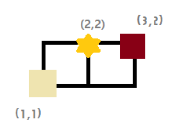
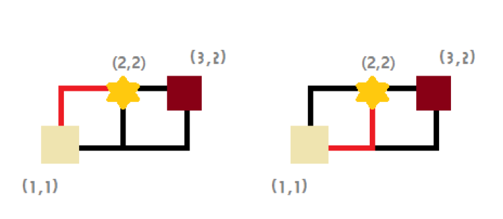

## 문제

인하대학교에 다니는 토쟁이는 y축과 평행한 *w*개의 도로, x축과 평행한 *h*개의 도로가 있는 도시에 살고 있다. 토쟁이의 집은 이 도시의 맨 왼쪽 아래에 위치하며 좌표로는 (1, 1)로 표시할 수 있다. 매일 아침 토쟁이는 등교를 하며, 등굣길에 토스트 가게에 들러 토스트를 사 먹는다. 이때 학교의 위치는 토쟁이의 집 반대쪽 맨 오른쪽 위에 위치하며 좌표로는 (*w*, *h*)로 표시할 수 있다. 토쟁이는 늦장 부리는 것을 좋아하여 수업 시작 시간에 맞게 도착하게끔 출발한다. 따라서 토스트 가게를 거쳐 학교로 가는 경로는 항상 최소의 시간이 걸려야 한다. (토쟁이는 토스트를 매우 빠르게 먹어 0초 만에 먹으며, 토스트 가게 아주머니 역시 토스트 장인이기 때문에 0초 만에 토스트를 만든다고 가정한다) 이때, 토쟁이가 토스트를 먹고 학교에 늦지 않게 도착할 수 있는 경로는 몇 가지일까??

예를 들면, y축과 평행한 도로가 3개 있으며, x축과 평행한  도로가 2개 있다고 했을 때, 도시는 아래의 그림과 같이 그려진다.

이때, 토스트 가게가 (2,2)에 위치하면, 토쟁이의 집은 (1,1)에 위치하고, 학교는 (3,2)에 위치하므로, 이때 경로들은

위와 같이 2가지이다.

## 입력

입력의 첫째 줄에 도시의 y축과 평행한 도로의 개수 *w*와 x축과 평행한 도로의 개수 *h*가 주어진다. (2 ≤ *w*, *h* ≤ 200)

둘째 줄에는 토스트 가게의 (*x*, *y*)좌표가 주어진다. (1 ≤ *x* ≤ *w*,1 ≤ *y* ≤ *h*) *x*, *y*는 항상 정수이다.

## 출력

첫째 줄에 토쟁이가 학교에 늦지 않게 도착할 수 있는 등굣길의 개수를 1,000,007로 나눈 나머지 값을 출력한다.
