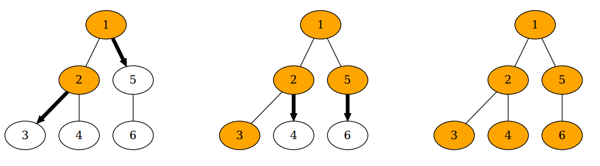
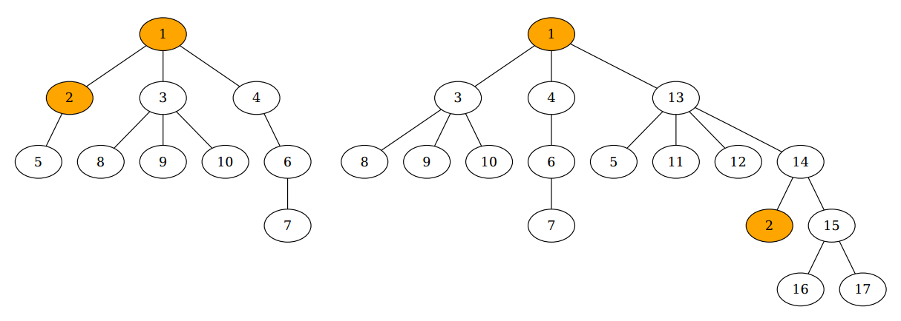

## 문제

Mirko works at a data centre and today’s task is to copy a file sized 1 GiB to *n* computers. The computers are denoted with integers from 1 to *n* and are connected so that they form a so-called *tree*. More precisely, *n* − 1 pairs of computers are directly connected via network cable in a way that there is a unique path between each pair of computers.

Figure 4: In the first sample test, it takes two minutes for the file to be copied to all computers.

Initially, Mirko manually placed the file on two different computers – computer *a* and computer *b* and is now writing commands that will copy the file to all other computers. The file can be copied from computer *x* to computer *y* only if the two computers are directly connected, and the copying process takes exactly one minute. At any moment, each individual computer can take part in at most one copying process, but it is allowed to have the file being copied between arbitrarily many different pairs of computers at the same time. Therefore, when the copying process ends from computer *x* to computer *y*, it is possible in the next minute to copy the file from computer *x* to computer *w* and from computer *y* to computer *z*.

Determine the minimal amount of time it takes for the file to be copied to all computers.

## 입력

The first line of input contains the integer *n* and two different integers *a* and *b* (1 ≤ *a*, *b* ≤ *n*) – the number of computers and the labels of the computers already containing the file. Each of the following *n* − 1 lines contains two different integers *x* and *y* (1 ≤ *x*, *y* ≤ *n*) – the labels of the computers directly connected via network cable. The computer network forms a tree, as described in the task.

## 출력

You must output the required minimal amount of time in minutes.

## 힌트

Figure 5: Illustrations of the second and third sample test
