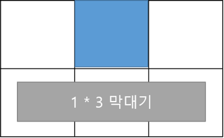

## 문제

영선이와 효빈이는 이번 컨테스트 개최자이다. 둘 밖에 없기에 대회 스태프도 겸하는데, 소규모 대회이고 실제 대회와 달리 풍선을 달아주거나 기타 일이 없기 때문에, 사고가 터지지 않는 한 크게 할 일이 없다.

그래서 대회 동안 딴 짓을 할 게임을 준비했으니, 그 이름하여 "막대기 게임"이다. 게임 규칙은 다음과 같다.

1. N\*M모양의 격자 판이 있다.
2. 곳곳에 막대기를 둘 수 없는 장애물이 있다.
3. 임의의 1\*k의 막대기들이 무한히 있다.
4. 두 사람이 번 갈아 가며 막대기를 하나 골라 임의의 위치에 둔다.
5. 더 이상 둘 곳이 없으면 그 사람이 진다.
6. 막대기는 겹쳐서 둘 수 없으며, 회전할 수도 없다.

(위 그림처럼 막대기를 둘 수 있다)

생각보다 여유가 있었던 두 사람은 충분히 생각하여 언제나 최적의 수로 게임을 진행한다. 게임은 항상 영선이가 먼저 시작한다. 게임 판이 주어졌을 때 이기는 사람의 아이디를 출력한다.

## 입력

첫째 줄에 n , m이 주어진다. (1 ≤ n, m ≤ 1,000)

다음 n줄로 m개의 게임 격자 판이 주어진다.

빈 공간이라면 '.' 장애물이 존재한다면 '@'으로 표시된다.

다음 줄에는 막대기의 종류의 수 k가 주어진다. (1 ≤ k ≤ 1,000)

다음 줄에는 k개의 수 pi가 오름차순으로 주어진다. (1 ≤ pi ≤ 1,000)

## 출력

영선이가 이긴다면 "nein" 효빈이가 이긴다면 "hyo123bin"을 출력한다
