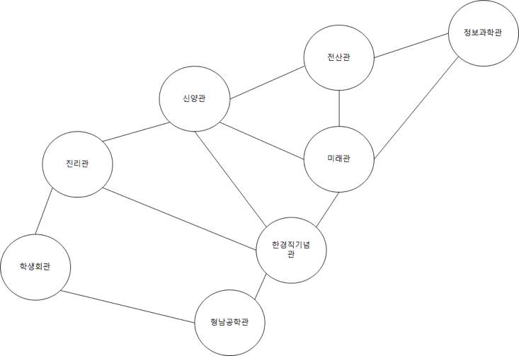

## 문제

숭실 대학교 정보 과학관은  캠퍼스의 길 건너편으로 유배를 당했다. 그래서 컴퓨터 학부 학생들은 캠퍼스를 ‘본대’ 라고 부르고 정보 과학관을 ‘정보대’ 라고 부른다. 준영이 또한 컴퓨터 학부 소속 학생이라서 정보 과학관에 박혀있으며 항상 본대를 가고 싶어 한다. 어느 날 준영이는 본대를 산책하기로 결심하였다. 숭실 대학교 캠퍼스 지도는 아래와 같다.

(편의 상 문제에서는 위 건물만 등장한다고 가정하자)

한 건물에서 바로 인접한 다른 건물로 이동 하는 데 1분이 걸린다. 준영이는 산책 도중에 한번도 길이나 건물에 멈춰서 머무르지 않는다. 준영이는 할 일이 많아서 딱 D분만 산책을 할 것이다. (산책을 시작 한 지 D분 일 때, 정보 과학관에 도착해야 한다.) 이때 가능한 경로의 경우의 수를 구해주자.

## 입력

D 가 주어진다 (1 ≤ D ≤ 100,000)

## 출력

가능한 경로의 수를 1,000,000,007로 나눈 나머지를 출력 한다.
