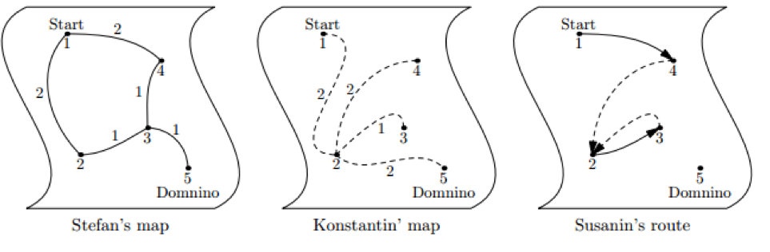

## 문제

어떤 나라의 군대가 Kostroma시에서 Domino마을로 이동하고 있다. 두 명의 장군 Stefan과 Konstantin이 이 군대를 안내하고 있다.

Stefan과 Konstantin은 해당 지역에 대한 서로 다른 지도를 갖고 있다. 지도에 표시된 마을들의 위치는 같지만, Stefan의 지도에는 큰 길들에 관한 정보만이, Konstantin의 지도에는 작은 샛길들에 관한 정보만이 기록되어 있다. 낮에 큰 길을 이용하는 것은 위험하므로, Stefan과 Konstantin은 다음과 같은 방법으로 군대를 이동시키고 있다: 낮에는 Konstantin의 지도를 이용해 하나의 오솔길을 통해, 밤에는 Stefan의 지도를 이용해 하나의 큰 길을 통해 이동한다.

이 군대 속에는 Susanin이라는 첩자가 있다. 그는 Stefan과 Konstantin의 지도를 보고, 그들 장군이 어떤 길을 선택하도록 할지 결정하는 역할을 하고 있다. 그는 장군들에게 잘못된 길을 알려주어, Domino마을로의 이동거리를 최대한 길게 만들고 싶어한다. 하지만, Domino마을로의 방향과 완전히 다른 방향으로 이동하면 첩자라는 의심을 살 것이다. 따라서 Susanin은 각 지도 내에서의 최단거리가 감소하는 방향으로(Strictly Decreasing) 길을 안내하고자 한다. 즉, Susanin이 Stefan에게 선택해주는 길은 큰 길들만을 이용하였을 때의 Domino마을까지의 거리가 감소하는 방향으로 선택되어야 하며, Konstantin에게 선택해주는 길은 샛길들만을 이용하였을 때의 거리가 감소하는 방향으로 선택되어야 한다.

이때, Susanin이 택할 수 있는 가장 긴 경로의 길이를 구하시오.

## 입력

첫 번째 줄에는 지도상의 마을 개수 n, 행군을 시작하는 Kostroma시의 번호 s, 행군을 마치는 Domino마을의 번호 t가 주어진다. (2 ≤ n ≤ 1000, 1 ≤ s ≠ t ≤ n) 마을은 1~n번으로 번호가 매겨져 있다.

그 아래에는 각각 Stefan의 지도와 Konstantin의 지도를 나타내는 2개의 block이 주어진다.

각 block의 첫 번째 줄에는 길/샛길의 개수 m이 주어진다. (n-1 ≤ m ≤ 100,000)

다음 m개의 줄에는 각각 세 개의 자연수 a, b, l이 주어진다. 이는 a와 b 마을을 연결하는 양방향의 길이 l짜리 길/샛길이 존재함을 의미한다. (1 ≤ a,b ≤ n, 1 ≤ l ≤ 1,000,000)

각각의 지도에서, 모든 마을이 연결되어 있음은 보장된다. (한 지도의 길/샛길만을 이용해서 다른 모든 도시로 이동할 수 있다.) 군대는 첫 이동을 밤에 시작하므로, 처음 이용하는 지도는 Stefan의 지도이다. 군대는 도시 s에서 출발해, 밤마다 길 하나, 낮마다 샛길 하나를 따라 이동한다.

## 출력

Susanin이 Domino 마을에 도착하기까지 작성할 수 있는 최장 경로의 길이를 출력한다. 경로의 길이는 이동중 이용한 모든 길과 샛길의 길이의 합이다. 만약 Susanin이 영원히 Domino 마을에 도착하지 않은 채로 군대를 이동시킬 수 있다면, “-1”을 출력한다.
