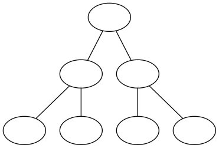
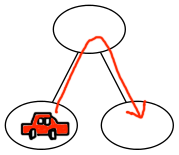
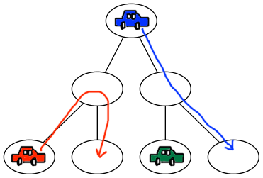

## 문제

BOJ 나라는 도시와 두 도시를 연결하는 도로로 이루어져 있다. 이 나라의 도로 네트워크는 포화 이진 트리의 형태를 가진다.

수빈이는 BOJ 나라의 도로 네트워크 트리의 높이 H를 알고 있다. 트리의 높이를 안다면, 도시의 개수와 도로의 개수도 구할 수 있다. 트리의 높이가 H인 경우에 도시의 개수는 2(H+1)-1개 이고, 도로의 개수는 2(H+1)-2개가 된다.

아래 그림은 H = 2일 때, 그림이다.

수빈이는 도로 네트워크에 차를 보내려고 한다. 모든 차는 시작 도시와 도착 도시가 있으며, 같은 도시를 두 번 이상 방문하지 않는다. 차의 시작 도시와 도착 도시가 같을 수도 있다.

모든 도시를 방문한 차의 개수가 모두 1개가 되기 위해서, 수빈이가 차를 최소 몇 대를 보내야 하는지 구하는 프로그램을 작성하시오.

## 입력

첫째 줄에 H이 주어진다. (0 ≤ H ≤ 60)

## 출력

모든 도시를 방문한 차의 개수가 모두 1개가 되기 위해서, 수빈이가 차를 최소 몇 대를 보내야 하는지 출력한다.

정답은 항상 64비트 정수로 나타낼 수 있다.

## 힌트

예제 1

예제 2

