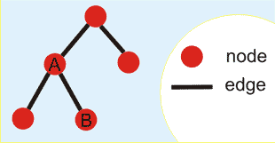
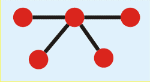

## 문제

N개의 노드와 N-1개의 간선으로 이루어져 있는 그래프를 만들려고 한다. 이 그래프는 연결되어 있어야 한다.

예를 들어, 아래 그림은 N=5개의 노드와 N-1=4개의 간선으로 이루어져 있는 그래프이다.

간선은 두 노드를 연결할 수 있다. 노드의 차수는 노드와 연결되어 있는 간선의 개수이다. 위의 그림에서 A의 차수는 3이고, B의 차수는 1이다.

N이 주어졌을 때, 적절히 그래프를 만들어서 그래프의 점수를 최대로 만들려고 한다. 그래프의 점수는 각 노드의 점수를 더해서 구할 수 있으며, 각 노드의 점수는 차수에 의해서 결정된다.

입력으로, 차수에 대한 점수가 주어졌을 때, 만들 수 있는 그래프의 점수의 최댓값을 구하는 프로그램을 작성하시오.

## 입력

첫째 줄에 그래프의 정점의 개수 N이 주어진다. (1 ≤ N ≤ 51)

둘째 줄에는 각 차수의 점수가 주어진다. (0 ≤ 점수 ≤ 10,000)

점수는 차수 1인 노드의 점수, 차수 2인 노드의 점수, ..., 차수 N-1인 노드의 점수 순서대로 주어진다.

## 출력

첫째 줄에 만들 수 있는 그래프 중에서 점수가 최대가 되는 것의 점수를 출력한다.

## 힌트

예제 1의 경우에 차수가 1인 노드의 점수는 1, 2인 노드의 점수는 3, 3인 노드의 점수는 0이다.

아래 그림과 같은 그래프를 만들면 그래프의 점수가 최대가 된다.

그래프의 차수를 계산해보면 1, 2, 2, 1이다. 따라서, 합은 1+3+3+1 = 8이 된다.

예제 2의 경우에 가능한 정답은 아래 그림과 같다.

