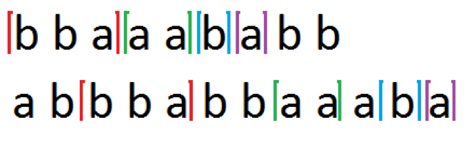

## 문제

병찬이는 문자열 A와 B를 가지고 있다. 두 문자열이 꽤 비슷하다고 생각한 병찬이는 A 문자열에서 겹치지 않는 부분문자열을 K개 뽑아 A에서의 등장 순서대로 p1, p2, … pk라고 하고 이 모두를 포함하는 문자열 집합을 P라고 이름 붙였다. 이 문자열들은 B 문자열에서도 겹치지 않게 동일한 순서로 나타난다.

다음은 문자열 집합 P에 관한 설명이다.

1. P에 속하는 문자열은 정확히 K개이며, 모든 문자열은 길이가 1 이상이다.
2. 문자열 A는 a1 p1 a2 p2 … ak pk ak+1로 나타낼 수 있다. 이때 a1, a2, … ak+1은 각각 임의의 문자열이며, 길이가 0일 수도 있다.
3. 문자열 B는 b1 p1 b2 p2 … bk pk bk+1로 나태낼 수 있다. 이때 b1, b2, … bk+1은 각각 임의의 문자열이며, 길이가 0일 수도 있다.
4. P에 속하는 모든 문자열의 길이의 합을 PL이라고 한다.

병찬이는 이를 만족하는 PL의 최댓값을 알고싶다. 예를 들어, 문자열 A가 “bbaaaababb”이고 문자열 B가 “abbbabbaabab”라면 PL을 최대로 하는 P는 {“bba”, “aa”, “b”, “a”}로 이때 PL은 7이 된다.

## 입력

첫 줄에 세 개의 정수 N, M, K(1 ≤ N, M ≤ 1,000, 1 ≤ K ≤ 10)가 순서대로 주어진다. N은 문자열 A의 길이, M은 문자열 B의 길이, K는 문자열 P의 개수이다. 두 번째 줄에는 문자열 A가, 세 번째 줄에는 문자열 B가 주어진다. 모든 문자열은 영어 알파벳 소문자 26글자로만 이루어진다.

## 출력

한 줄에 PL의 최댓값을 출력한다. 어떤 P도 존재하지 않는 경우는 들어오지 않는다.
