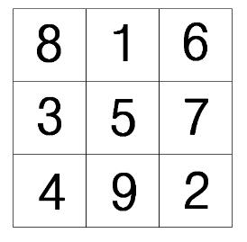

## 문제

마방진이란 N\*N의 격자의 각 칸에 1부터 N\*N까지의 정수를 정확히 하나씩 채웠을 때, 모든 가로줄, 세로줄, 대각선의 합이 같은 배치를 말한다.

예를 들면, 다음은 3\*3 마방진 중 하나이다. 가로줄, 세로줄, 대각선의 합이 모두 15로 같다는 것을 알 수 있다.

N이 주어졌을 때 N\*N 마방진을 하나 구해 보자.

## 입력

첫째 줄에 자연수 N이 주어진다. (3 ≤ N ≤ 300)

## 출력

N\*N 크기의 마방진을 아무거나 출력한다.
