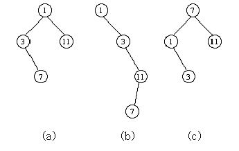

## 문제

지성이는 매우 운이 좋게도 "Goggle"이라는 회사에 일하게 되었다. 그는 자신에게 주어진 첫 번째 임무를 멋있게 수행함으로써 자신의 능력을 보여주고 싶었다. 그의 첫 번째 임무는 효율적인 검색 엔진을 구성하는 것이었다. 그는 검색엔진에 사용되는 서로 다른 k개의 A1, A2, ..., Ak 정수로 구성된 key를 받았다.

사용자는 검색엔진에 자신이 검색하고자 하는 1 이상 n 이하인 수 s를 입력한다. 지성이는 곰곰이 생각한 끝에 이진탐색트리를 이용하여 이 임무를 수행하기로 결정했다.

이진트리는 하나의 노드에서 이것과 연결된 자식이 0, 1, 2개로 구성된 트리이다. 그리고 서브트리와 연결된 노드를 루트라 한다. 만약 우리가 이 노드 상에 key 값을 넣는다면 각각의 노드는 서로 다른 key 값을 가지게 될 것이다.

이진탐색트리란 자신의 왼쪽과 오른쪽 서브트리가 모두 이진탐색트리이고 왼쪽 서브트리의 모든 노드의 key 값이 루트의 key 값보다 작고 오른쪽 서브트리의 모든 key 값이 루트의 key 값보다 큰 이진 트리를 말한다.

트리(a)는 1, 3, 7, 11의 key 값으로 구성된 이진트리라는 것을 알 수 있다. 위의 세 개의 트리 중 이진탐색트리인 것은 (b)와 (c)이다. 그리고 트리(a),(b)의 루트는 1이고 트리(c)의 루트는 7이라는 것을 알 수 있다.

이진탐색트리에서의 탐색 방식은 아래의 순서를 따른다.

1. 루트에서부터 시작한다.
2. 만약 사용자가 입력한 s가 현재 노드의 key값과 일치한다면 key 값을 찾은 것이고 아니라면 step 3으로 넘어간다.
3. 만약 s가 현재 노드의 key값보다 작으면 왼쪽서브트리로, 크다면 오른쪽 서브트리로 이동한다. (만약 이동한 서브트리가 비었다면 key값은 찾지 못한 것으로 종료된다.) step 2로 이동한다.

이 이진탐색트리의 효율성은 1부터 n까지 각각의 수들을 검색할 때의 횟수의 총 합으로 따지며 이 값이 작을수록 효율성이 높다고 한다. 트리(c)를 검색엔진으로 사용했을 때 n이 11일 경우 각각의 수들에 대한 횟수가 아래 표로 나타나있다.

|  |  |  |  |  |  |  |  |  |  |  |  |
| --- | --- | --- | --- | --- | --- | --- | --- | --- | --- | --- | --- |
| key | 1 | 2 | 3 | 4 | 5 | 6 | 7 | 8 | 9 | 10 | 11 |
| 횟수 | 2 | 3 | 3 | 3 | 3 | 3 | 1 | 2 | 2 | 2 | 2 |

우리가 해야 할 일을 지성이를 도와주어진 n에 대해 총 합이 가장 작게 되는 이진탐색트리를 찾는 것이다. 단, key 값의 최댓값은 n보다 항상 작거나 같다고 하자.위의 표에서 횟수의 총 합은 26이 되고 이 트리의 효율성은 26으로 판정된다.

## 입력

첫 번째 줄에 n (1 ≤ n ≤ 10,000,000)이 입력된다. 두 번째 줄에는 key의 개수인 k (k ≤ 300)가 입력되고 그 아래로 k개의 줄에 차례대로 Ai (1 ≤ Ai ≤ 10,000,000)의 값이 입력된다.

## 출력

효율성이 가장 좋은 이진탐색트리에 대한 총합을 출력한다.
