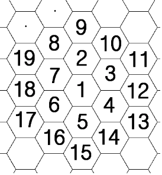

## 문제

지민이는 벌집에 빠졌다. 출구가 어디에 있는지는 아는데, 어떻게 가야 하는지를 모른다.

그곳에 있는 벌들에 의하면 방의 번호는 다음과 같이 붙는다.

지민이는 지금 a번 방에 있다. b번 방이 출구인데 어떻게 이동해야 할까? 집에는 민식이가 기다리고 있기 때문에, 가장 빠르게 탈출하기 위해 최단거리로 움직이고 싶다.

## 입력

첫째 줄에는 당신이 있는 방의 번호 a와 출구가 있는 방의 번호 b가 주어진다.1 ≤ a, b ≤ 1,000,000)

## 출력

첫째 줄에 탈출을 위해 최단거리로 지나는 방의 번호를 공백으로 구분해 출력한다.
