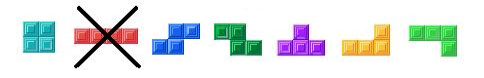
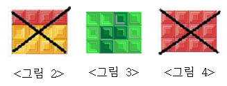

## 문제

김진영은 테트리스 국가대표이다. 국가대표이기 때문에 실력도 물론 뛰어나다. 지금까지 한번도 최백준과 강민승에게 진 적이 없으므로 김진영은 더 이상 연습할 필요가 없다고 생각했다. 이제 할 일이 없어진 김진영은 갑자기 이런 생각을 했다. 테트리스 블록을 $3 \times N$ 크기로 차곡차곡 쌓는 방법은 총 몇 가지가 있을까?

테트리스에는 다음과 같이 $7$개의 블록이 있다. 그러나 김진영은 테트리스를 할 때 $1 \times 4$ 크기의 블록을 사용하지 않는다. 따라서 김진영은 테트리스에는 총 $6$개의 블록을 이용할 것이다. <그림 1>을 참고한다.

<그림 1>

$7$개의 블록은 $90$, $180$, $270$도 방향으로 회전시킬 수 있다.

다음은 3\*4크기로 테트리스 블록을 차곡차곡 쌓을 수 없는 두 가지 예와, 쌓을 수 있는 한 가지 예이다.

<그림 2>: 김진영 조교는 $1 \times 4$ 크기의 블록을 사용하지 않는다.

<그림 3>: 올바른 방법이다.

<그림 4>: 그림 2와 같은 이유다.

## 입력

첫째 줄에 $N$이 주어진다. $N$은 $300$보다 작거나 같은 자연수이다.

## 출력

첫째 줄에 테트리스 조각을 $3 \times N$크기로 쌓는 경우의 수를 $1\,000\,000$으로 나눈 나머지를 출력한다.
