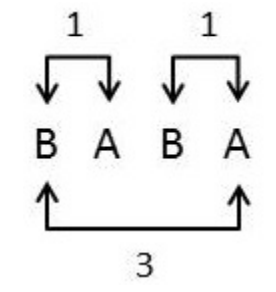

## 문제

You are given a string s consisting only of upper case letters A and B. For an integer k, a pair of indices i and j (1 ≤ i < j ≤ n) is called a k-inversion if and only if s[i] = B, s[j] = A and j − i = k.

Consider the string BABA. It has two 1-inversions and one 3-inversion. It has no 2-inversions.

For each k between 1 and n − 1 (inclusive), print the number of k-inversions in the string s.

## 입력

Each input will consist of a single test case. Note that your program may be run multiple times on different inputs. The input will consist of a single line with a string s, which consists of only upper case As and Bs. The string s will be between 1 and 1,000,000 characters long. There will be no spaces.

## 출력

Output n − 1 lines, each with a single integer. The first line’s integer should be the number of 1-inversions, the second should be the number of 2-inversions, and so on.
