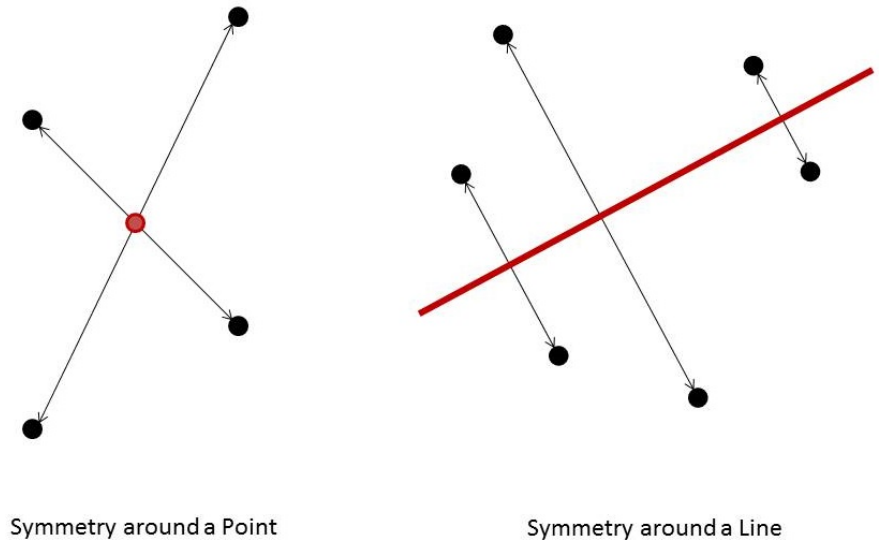

## 문제

You are totally bored with nothing to do. You notice a pattern of spots on the wall in front of you and begin to dwell on them. There is no obvious pattern of symmetry. With time this becomes very grating, and you contemplate adding more spots to satisfy your quest for balance. For this exercise you are to resolve this situation with a computer program.

Given an array of spots with coordinates in the range from −20,000 to 20,000, determine the fewest additional spots needed to generate a pattern with some symmetry. The symmetry can be around a point or across a line. If the symmetry is around a point, the point does not need to be a spot in the data, or even a point with integral coordinates. If the symmetry is across a line, the line may be at any angle. The coordinates of the additional spots may or may not be within the −20,000 to 20,000 limits.

## 입력

Each input will consist of a single test case. Note that your program may be run multiple times on different inputs. The first line of input will consist of a single integer n (1 ≤ n ≤ 1,000) indicating the number of spots. Each of the next n lines will hold two space-separated integers x and y (−20,000 ≤ x, y ≤ 20,000), which are the coordinates of a spot. The locations of all spots are guaranteed to be unique.

## 출력

Output a single integer, indicating the smallest number of spots which need to be added so that all of the spots are symmetric about some point, or about some line.
