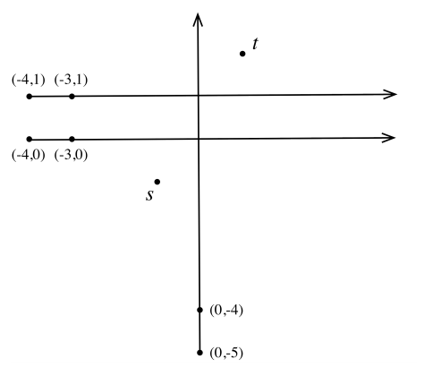

## 문제

You are participating in a game with several of your classmates. Each of your opponents has a device that generates a laser beam from the location of that person in the direction that (s)he chooses all the way to the infinity. Once all of the beams are chosen and fixed, your turn starts. Your job is to run from your current location s to the destination t in a path that crosses the minimum number of the laser beams.

For simplicity, we assume that the game is played on a two-dimensional plane with your n opponents, o1, . . . , on located in n distinct points p1, p2, · · · , pn. Each opponent oi starts his/her one-way laser beam in a direction. Some beams can be in parallel. Two points s and t (different from other points) are given. You are standing in s and have to run in a path to reach t such that the running path crosses the minimum number of beams.

## 입력

There are multiple test cases in the input. The first line of each test case contains n, the number of laser beams (1 ≤ n ≤ 200). Each of the next n lines contains 4 space separated integers. The first two integers specify the x and y coordinates of the location of an opponent, and the other two integers are the x and y coordinates of a point lying on the laser beam. The last line contains the x and y coordinates of s and t, respectively. You can assume no three points of the input are co-linear and the absolute value of the coordinates will not exceed 108. The input terminates with a line containing 0 which should not be processed.

## 출력

For each test case, output a line containing the minimum number of beams to cross.
