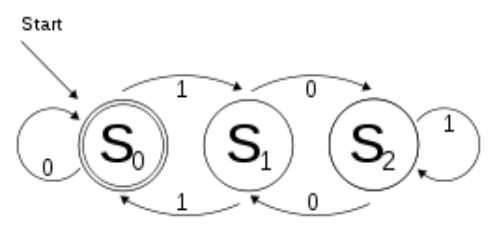

## 문제

You have possibly heard of DFAs. In theory of computation, a deterministic finite automaton (DFA) is a finite state machine that accepts/rejects finite input strings. The figure on the right illustrates a DFA using a state diagram. In the automaton, there are three states: S0, S1, and S2 (denoted graphically by circles). The automaton takes a finite sequence of 0s and 1s as input. For each state, there is a transition arrow leading out to a next state for both 0 and 1. Upon reading a symbol, a DFA jumps from a state to another by following the transition arrow. For example, if the automaton is currently in state S0 and current input symbol is 1 then it jumps to state S1. This is formally written as δ(S0, 1) = S1. Inductively, we can generalize this notation to have propositions like δ(S0, 10) = S2 and δ(S1, 011010) = S0. A DFA has a start state (denoted graphically by an arrow coming in from nowhere) where computations begin with, and a set of accept states (denoted graphically by a double circle) which help define when a computation is successful. So, an input string w is accepted by a DFA with starting state q0 if and only if δ(q0, w) is an accepting state of that DFA. The state S0 in the DFA depicted above is both the start state and an accept state. In fact, this DFA accepts only binary numbers that are multiples of 3 (including the empty string).

Given A DFA D with states S0, S1, … , Sn-1, a string w is called history-cleaner for D if for all i,j ∈ {0, … , n-1}: δ(Si, w) = δ(Sj, w). In other words, no matter which state the starting state is, the string w brings the DFA to a common final state. A DFA D is called history-cleanable if a history-cleaner string exists for D. Given a DFA whose input is a sequence of 0s and 1s, your job is to find out whether it is history-cleanable or not.

## 입력

The first line of the input contains the single integer t, the number of test cases (1 ≤ t ≤ 500). Each test case starts with a line containing a single integer n, the number of states in a DFA with states S0, S1, …, Sn-1(2 ≤ n ≤ 500). The second line of each test case consists of n space-separated integers a0, a1, …, an-1 and finally, the third line of each test case has n space-separated integers b0, b1, …, bn-1 (0 ≤ ai, bi < n) which means δ(Si, 0) = Sai and δ(Si, 1) = Sbi (for 0 ≤ i < n).

## 출력

For each test case, print one line containing the answer for the given DFA. If it is history-cleanable, print “YES”, otherwise print “NO” (omit the quotes).
