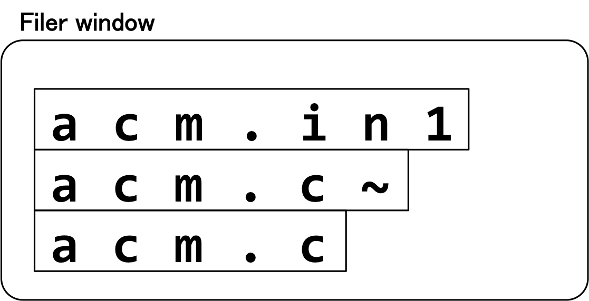
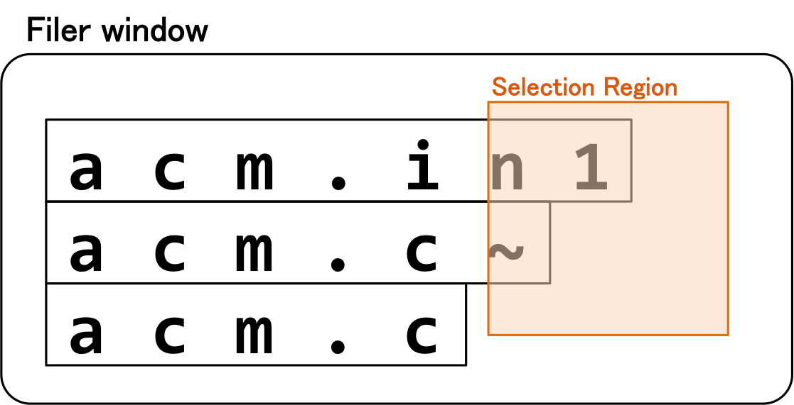
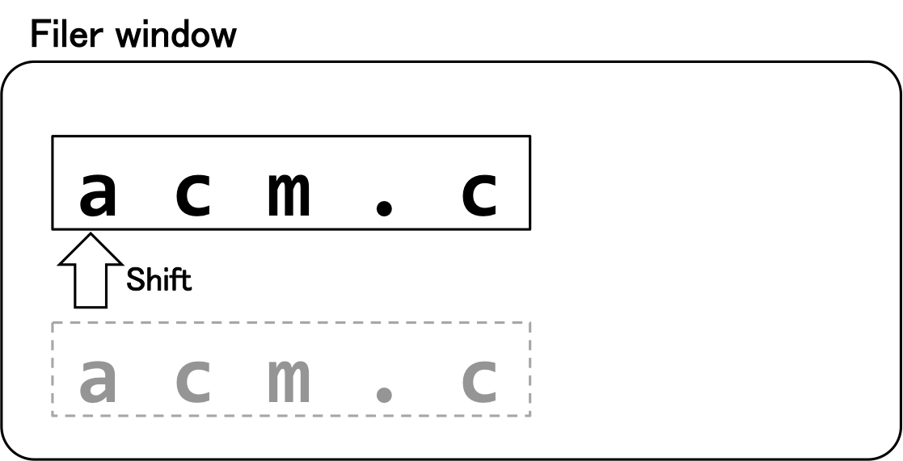

## 문제

You are using an operating system named "Jaguntu". Jaguntu provides "Filer", a file manager with a graphical user interface.

When you open a folder with Filer, the name list of files in the folder is displayed on a Filer window. Each filename is displayed within a rectangular region, and this region is called a filename region. Each filename region is aligned to the left side of the Filer window. The height of each filename region is 1, and the width of each filename region is the filename length. For example, when three files "acm.in1", "acm.c~", and "acm.c" are stored in this order in a folder, it looks like Fig.C-1 on the Filer window.



Fig.C-1

You can delete files by taking the following steps. First, you select a rectangular region with dragging a mouse. This region is called selection region. Next, you press the delete key on your keyboard. A file is deleted if and only if its filename region intersects with the selection region. After the deletion, Filer shifts each filename region to the upside on the Filer window not to leave any top margin on any remaining filename region. For example, if you select a region like Fig.C-2, then the two files "acm.in1" and "acm.c~" are deleted, and the remaining file "acm.c" is displayed on the top of the Filer window as Fig.C-3.



Fig.C-2



Fig.C-3

You are opening a folder storing NN files with Filer. Since you have almost run out of disk space, you want to delete unnecessary files in the folder. Your task is to write a program that calculates the minimum number of times to perform deletion operation described above.

## 입력

The input consists of a single test case. The test case is formatted as follows.

```

N
D1 L1
D2 L2
...
DN LN
```

The first line contains one integer N (1 ≤ N ≤ 1,000), which is the number of files in a folder. Each of the next N lines contains a character Di and an integer Li: Di indicates whether the i-th file should be deleted or not, and Li (1 ≤ Li≤ 1,000) is the filename length of the i-th file. If Di is 'y', the i-th file should be deleted. Otherwise, Di is always 'n', and you should not delete the i-th file.

## 출력

Output the minimum number of deletion operations to delete only all the unnecessary files.
