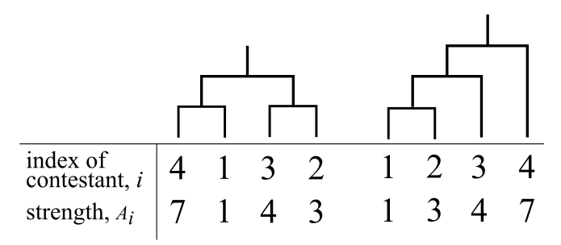

## 문제

In 21XX, an annual programming contest "Japan Algorithmist GrandPrix (JAG)" has been one of the most popular mind sport events. You, the chairperson of JAG, are preparing this year's JAG competition.

JAG is conducted as a knockout tournament. This year, N contestants will compete in JAG. A tournament is represented as a binary tree having N leaf nodes, to which the contestants are allocated one-to-one. In each match, two contestants compete. The winner proceeds to the next round, and the loser is eliminated from the tournament. The only contestant surviving over the other contestants is the champion. The final match corresponds to the root node of the binary tree.

You know the strength of each contestant, A1, A2, ⋯, AN, which is represented as an integer. When two contestants compete, the one having greater strength always wins. If their strengths are the same, the winner is determined randomly.

In the past JAG, some audience complained that there were too many boring one-sided games. To make JAG more attractive, you want to find a good tournament configuration.

Let's define the boringness of a match and a tournament. For a match in which the i-th contestant and the j-th contestant compete, we define the boringness of the match as the difference of the strength of the two contestants, |Ai − Aj|. And the boringness of a tournament is defined as the sum of the boringness of all matches in the tournament.

Your purpose is to minimize the boringness of the tournament.

You may consider any shape of the tournament, including unbalanced ones, under the constraint that the height of the tournament must be less than or equal to K. The height of the tournament is defined as the maximum number of the matches on the simple path from the root node to any of the leaf nodes of the binary tree.

Figure K-1 shows two possible tournaments for Sample Input 1. The height of the left one is 2, and the height of the right one is 3.



Figure K-1. Two possible tournaments for Sample Input 1

Write a program that calculates the minimum boringness of the tournament.

## 입력

The input consists of a single test case with the following format.

```

N K
A1 A2 ⋯⋯ AN
```

The first line of the input contains two integers N (2 ≤ N ≤ 1,000) and K (1 ≤ K ≤ 50). You can assume that N ≤ 2K. The second line contains N integers A1,A2,⋯AN. Ai (1 ≤ Ai≤ 100,000) represents the strength of the i-th contestant.

## 출력

Output the minimum boringness value achieved by the optimal tournament configuration.
