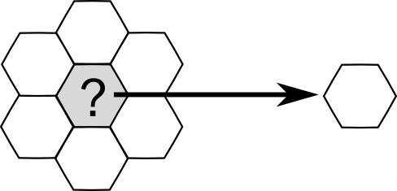
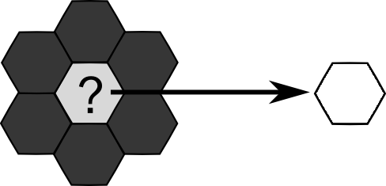
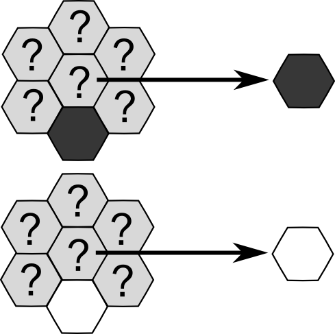
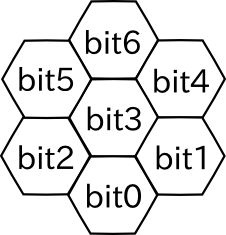

## 문제

Let's consider operations on monochrome images that consist of hexagonal pixels, each of which is colored in either black or white. Because of the shape of pixels, each of them has exactly six neighbors (e.g. pixels that share an edge with it.)

"Filtering" is an operation to determine the color of a pixel from the colors of itself and its six neighbors. Examples of filterings are shown below.

Example 1: Color a pixel in white when all of its neighboring pixels are white. Otherwise the color will not change.



Performing this operation on all the pixels simultaneously results in "noise canceling," which removes isolated black pixels.

Example 2: Color a pixel in white when its all neighboring pixels are black. Otherwise the color will not change.



Performing this operation on all the pixels simultaneously results in "edge detection," which leaves only the edges of filled areas.

Example 3: Color a pixel with the color of the pixel just below it, ignoring any other neighbors.



Performing this operation on all the pixels simultaneously results in "shifting up" the whole image by one pixel.

Applying some filter, such as "noise canceling" and "edge detection," twice to any image yields the exactly same result as if they were applied only once. We call such filters idempotent. The "shifting up" filter is not idempotent since every repeated application shifts the image up by one pixel.

Your task is to determine whether the given filter is idempotent or not.

## 입력

The input consists of multiple datasets. The number of dataset is less than 100. Each dataset is a string representing a filter and has the following format (without spaces between digits).

```

 c0c1⋯c127
```

ci is either '0' (represents black) or '1' (represents white), which indicates the output of the filter for a pixel when the binary representation of the pixel and its neighboring six pixels is i. The mapping from the pixels to the bits is as following:



and the binary representation i is defined as i=∑6j=0bitj×2j, where bitj is 0 or 1 if the corresponding pixel is in black or white, respectively. Note that the filter is applied on the center pixel, denoted as bit 3.

The input ends with a line that contains only a single "#".

## 출력

For each dataset, print "yes" in a line if the given filter is idempotent, or "no" otherwise (quotes are for clarity).
