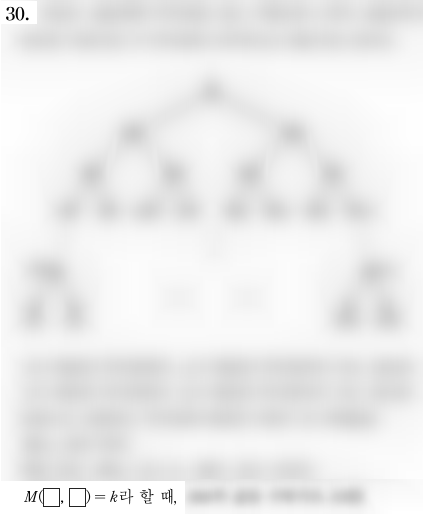

## 문제

혹시 2007학년도 대학수학능력시험 수리영역 가형 이산수학 30번 문제를 아는가? 여러분은 수능을 치는 수험생의 마음으로 이 문제를 해결해야만 한다.

하지만 우리는 저작권 위반으로 판사님을 뵙고 싶지 않았기 때문에 이 문제를 직접 수록할 수는 없었다. 아래 링크 중 하나를 클릭해서 pdf 파일을 내려받아 가장 마지막 페이지를 보면, 위의 그림과 아주 유사한 문제가 하나 있을 것이다. 여러분은 바로 그 문제를 해결해야만 한다.

* [http://wdown.ebsi.co.kr/W61001/01exam/20061116/mathga1\_mun.pdf](./002_mathga1_mun.pdf)
* [http://www.suneung.re.kr/boardCnts/fileDown.do?fileSeq=e7700624691c4dcb8a2cfc3f959204fe](./003_fileDown.do)

문제를 그대로 내면 재미없기 때문에, 우리는 위 그림과 같이 33과 79가 적혀 있던 부분을 하얀색 직사각형으로 가렸다. 그림에서 흐릿하게 보이는 모든 부분은 원래 문제와 다르지 않다.

빈 칸에 들어갈 두 자연수가 주어졌을 때 문제를 해결하는 프로그램을 작성하자.

## 입력

첫 번째 줄에 테스트 케이스의 수 T (1 ≤ T ≤ 50 000)가 주어진다. 이후 T개의 테스트 케이스가 주어진다. 각 테스트 케이스는 한 줄로 구성되어 있으며, 각 줄에는 두 개의 정수 A와 B (1 ≤ A, B ≤ 1 023, A ≠ B)가 공백을 사이로 두고 주어진다. 이는 첫 번째 빈 칸에는 A를, 두 번째 빈 칸에는 B를 넣었을 때 답을 구하라는 의미이다

## 출력

각 테스트 케이스에 대해 답을 한 줄에 하나씩 출력한다.
