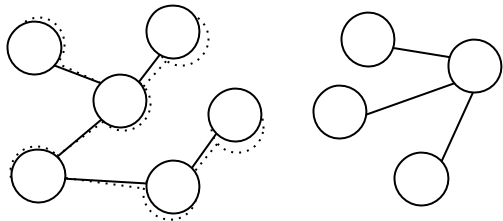
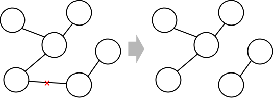
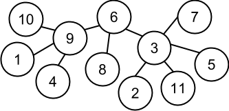

## 문제

트리란 정점이 *n*개이고 간선이 *n* − 1개인 연결 그래프를 의미한다. 수찬이는 최근 트리를 배양하여 관찰하는 일에 푹 빠져 있다. 여느 날과 같이 트리를 지켜보던 그는 모든 트리는 정점의 개수가 2의 거듭제곱 꼴(20, 21, 22, ··· , 2k, ···)일 때 다른 트리와 전혀 반응하지 않고 움직임도 없다는 것을 우연히 발견하였다. 그는 이러한 트리가 안정적인 상태에 있다고 정의하였다.

정점이 6개인 트리는 안정적인 상태가 아니고, 정점이 4개인 트리는 안정적인 상태이다.

수찬이는 동료 과학자 지학이에게 이 사실을 공유하였다. 지학이는 수찬이의 연구 노트를 읽어보더니 수찬이에게 “모든 트리는 안정적인 상태가 되는 방향으로 변하지 않을까?”라고 말했다. 지학이의 말이 일리가 있다고 생각한 수찬이는 여러 실험을 통해 지학이의 추측이 사실임을 알아냈다. 그가 발견한 성질은, 어떤 트리가 안정적인 상태가 아니라면, 트리 스스로 간선들을 끊어 자신을 적절히 쪼개어 몇 개의 트리로 나누는데, 이때 각 트리의 정점의 개수가 2의 거듭제곱 꼴이 되게 함으로써 자신을 안정적인 상태로 만든다는 것이었다. 수찬이는 자신이 밝혀낸 성질을 지학이와 공유했다. 지학이는 수찬이의 발견에 흥미를 느끼고 실험 데이터를 분석하다가, 트리의 간선을 끊는 데에 에너지가 필요하다는 것을 알게 되었고, 이를 통해 트리가 안정적인 상태로 변하는 과정에서 끊기는 간선의 개수를 최소화하는 방법으로 나뉜다는 성질을 추가로 밝혀냈다.

정점이 6개인 어떤 트리가 안정적인 상태로 변하는 한 예.

수찬이와 지학이는 트리에는 더 많은 성질들이 있을 것이라고 보고, 새로운 성질을 발견하여 그들의 지적 호기심을 채우고자 한다. 그들은 트리가 정확히 어떤 방법으로 나뉘는지 알아보기 위해, 일단 자신들이 알아낸 성질을 따르면서 트리가 나뉘는 서로 다른 방법의 수를 관찰하여 그 특징을 찾고자 한다. 트리가 나뉘는 방법이 서로 다르다는 것은, 끊긴 간선의 집합이 서로 다르다는 것이다. (트리의 간선이 끊기는 순서는 상관이 없다!)

수찬이와 지학이를 돕기 위해, 정점이 *n*개인 트리가 주어졌을 때, 이 트리가 수찬이와 지학이가 발견한 성질을 따르면서 나뉘는 서로 다른 방법의 수를 구하는 프로그램을 작성하라.

## 입력

첫 번째 줄에는 트리의 정점의 수 *n*(2 ≤ *n* ≤ 4 095)이 주어진다. 트리의 각 정점에 1부터 *n*까지의 자연수 번호가 붙어 있다고 하자.

다음 (*n* − 1)개의 줄에는 트리의 간선에 대한 정보가 주어진다. 각 줄에는 간선이 잇는 두 정점의 번호를 나타내는 두 개의 자연수 *u*와 *v* (1 ≤ *u*, *v* ≤ *n*, *u* ≠ *v*)가 공백을 사이로 두고 주어진다.

## 출력

첫 번째 줄에 트리가 수찬이와 지학이가 발견한 성질을 따르면서 나뉘는 방법의 수를 109 + 7로 나눈 나머지를 출력한다.

## 힌트

첫 번째 예제에 주어진 트리를 그림으로 그려 보면 아래와 같다.

간선을 두 개 끊으면 정점이 4(= 22)개인 트리, 2(= 21)개인 트리, 1(= 20)개인 트리로 나눌 수 있으며, 아래와 같이 여섯 가지 방법이 있다. 실선은 남아 있는 간선을, 점선은 끊긴 간선을 의미한다.

   

   

   

두 번째 예제에 주어진 트리를 그림으로 그려 보면 아래와 같다.

이 경우 간선을 세 개 끊어서 안정적인 상태로 만들 수 있다. 트리가 나누어진 결과는 나뉜 각 트리들의 정점의 개수에 따라 크게 아래의 두 가지로 분류할 수 있다.

* 정점이 4(= 22)개인 트리 두 개와 정점이 2(= 21)개인 트리 하나와 정점이 1(= 20)개인 트리 하나로 나뉘는 경우:
  + 모든 가능한 방법에서 6번 정점과 9번 정점을 잇는 간선, 6번 정점과 3번 정점을 잇는 간선은 반드시 끊긴다. 이를 통해 정점이 4개인 트리 하나와 정점이 2개인 트리 하나가 결정된다.
  + 3번 정점과 2, 5, 7, 11번 정점을 잇는 간선 중 하나를 선택해서 끊으면, 정점이 4개인 트리 하나와 정점이 1개인 트리 하나가 추가로 결정된다.
  + 따라서 이 방법으로 트리를 나눌 수 있는 경우의 수는 4이다.

정점의 개수가 4, 4, 2, 1인 트리 네 개로 나누는 방법의 예

* 정점이 8(= 23)개인 트리 하나와 정점이 1(= 20)개인 트리 세 개로 나뉘는 경우:
  + 단말 정점(간선으로 연결된 정점의 개수가 1개인 정점) 세 개를 골라서, 그 정점과 연결된 간선 3개를 끊으면 된다.
  + 단말 정점이 8개 있으므로, 이 방법으로 트리를 나눌 수 있는 경우의 수는 \(8 \choose 3\)= 56이다.

정점의 개수가 8, 1, 1, 1인 트리 네 개로 나누는 방법의 예

따라서 총 경우의 수는 60이다.
