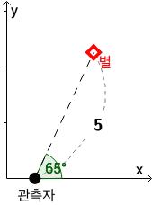
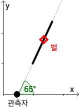

## 문제

‘코더스’와 ‘하이’는 2차원 좌표평면에 사는 천문학자들이다. 코더스는 점 (*xC*, 0) 위에, 하이는 (*xH*, 0)위에 가만히 서서, 하늘, 즉 좌표평면에서 *y* > 0인 부분에 떠 있는 별들을 관측한다.

각 천문학자는 편의상 자신의 위치를 기준으로 두고, 하늘 위의 점의 좌표를 (*r*, θ)와 같이 표현한다. *r*(> 0)은 관측자와 점 사이의 직선 거리를 의미하고, *θ*(0° < *θ* < 180°)는 관측자와 점을 잇는 반직선의, *x*축의 양의 방향에서 반시계 방향으로 잰 각의 크기(° 단위)를 의미한다.

관측자의 기준에서, 위 그림의 별의 위치는 (5, 65°)로 나타낼 수 있다.

코더스와 하이는 왜 이런 복잡한 방식으로 점의 위치를 나타내게 되었을까? 이는 그들이 사용하는 관측 장비에는 한계가 있어서, 관측자를 기준으로 한 별의 방향(*θ*)은 정확히 알 수 있지만, 관측자와 별 사이의 직선 거리(*r*)는 정확히 알 수 없고, 빛의 파형을 분석하여 별이 존재할 가능성이 있는 거리의 범위만을 알 수 있기 때문이다. 즉, 관측자는 관측 장비가 측정한 방향에서, 관측 장비가 측정한 거리 범위 내에는 최소 하나의 별이 존재한다는 것만을 알 수 있다.

관측자는 자신의 위치를 기준으로, 별의 방향과 거리 범위만을 측정할 수 있다.

두 사람은 이러한 한계를 잘 인지하고 있기에, 협력을 통해 관측 시 발생한 오차를 보완하기로 하였다. 이를 위해, 두 사람은 각자 하늘에 존재하는 모든 광원을 관측하여 측정 결과를 기록하였고, 이제 이 데이터를 취합하여 별들의 정확한 위치를 복원해내고자 한다. 단 그들은 별이 있을 수도 있고 없을 수도 있는 위치에는 별이 떠 있다고 가정하여, 만에 하나 놓칠 수도 있는 별이 없도록 하려고 한다. 같은 좌표에 별은 최대 한 개만 존재할 수 있다.

코더스와 하이를 위해, 하늘 위 별들의 위치를 두 사람의 관측 자료를 모두 만족하도록 복원하는 것이 가능한지 판별하고, 만약 가능하다면 그들이 복원해낸 별의 개수는 최대 몇 개일지를 구하는 프로그램을 작성하라.

## 입력

첫 번째 줄에는 코더스와 하이가 각각 서 있는 점의 위치를 나타내는 두 정수 *xC*과 *xH* (0 ≤ *xC* < *xH* ≤ 5 000)이 공백을 사이로 두고 주어진다. 코더스는 (*xC*, 0) 위에, 하이는 (*xH*, 0) 위에 가만히 서 있다.

두 번째 줄에는 코더스의 관측 횟수 *n* (1 ≤ *n* ≤ 100 000)이 주어진다.

다음 *n*개의 줄에는 코더스의 관측 데이터가 한 줄에 하나씩 주어진다. 각 줄에는 네 개의 정수 *θxC*, *θyC*, *sC*, *eC* (−5 000 < *θxC* < 5 000, 0 < *θyC* < 10 000, 0 < *sC* ≤ *eC* < 5 000)가 공백을 사이로 두고 주어진다. 이는 해당 관측에서 알아낸 정보는, 코더스에서 별을 향하는 반직선의 방향 벡터가 (*θxC*, *θyC*)이고, 별과 코더스 사이의 직선 거리는 *sC* 이상 *eC* 이하임을 의미한다.

그 다음 줄에는 하이의 관측 횟수 *m* (1 ≤ *m* ≤ 100 000)이 주어진다.

다음 *m*개의 줄에는 하이의 관측 데이터가 한 줄에 하나씩 주어진다. 각 줄에는 네 개의 정수 *θxH*, *θyH*, *sH*, *eH* (−5 000 < *θxH* < 5 000, 0 < *θyH* < 10 000, 0 < *sH* ≤ *eH* < 5 000)가 공백을 사이로 두고 주어진다. 이는 해당 관측에서 알아낸 정보는, 하이에서 별을 향하는 반직선의 방향 벡터가 (*θxH*, *θyH*)이고, 별과 하이 사이의 직선 거리는 *sH* 이상 *eH* 이하임을 의미한다.

코더스가 관측한 관측 결과끼리는 서로 닿거나 겹치지 않는다. 하이가 관측한 관측 결과끼리는 서로 닿거나 겹치지 않는다.

## 출력

만약 코더스와 하이의 관측 자료를 모두 만족하도록 하늘 위 별들의 위치를 복원하는 것이 가능하다면 첫 번째 줄에 두 사람이 복원해낸 별의 개수의 최댓값을 출력한다. 복원이 불가능하다면 “-1”(따옴표 제외) 를 출력한다.
