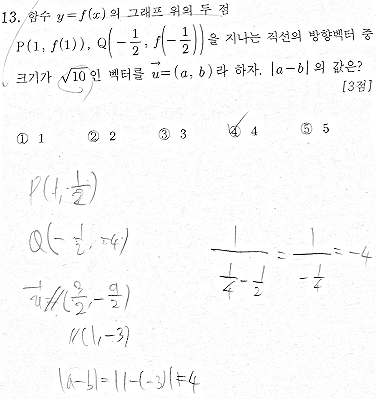
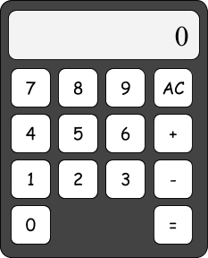
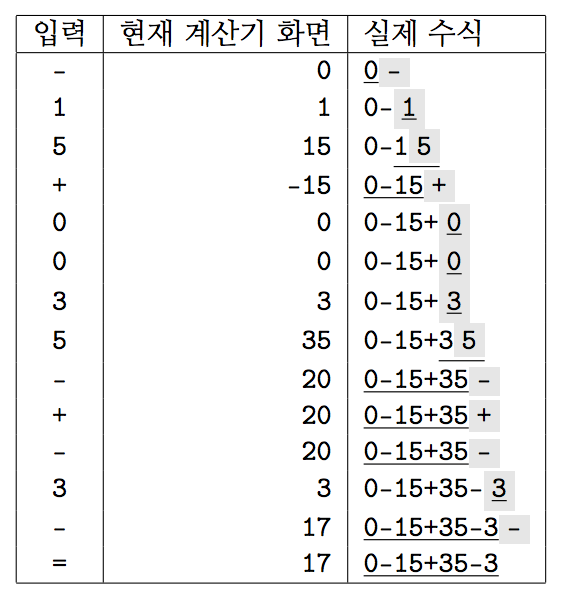

## 문제

수찬이는 수학 시험을 칠 때 문제를 다 풀어놓고 덧셈 또는 뺄셈을 잘못 하여 문제를 틀려버리는 안타까운 상황을 많이 경험한 바 있다. 예를 들어, 지난 7월 6일 시행된 2016학년도 7월 고3 전국연합학력평가의 수학 가형 시험에서, 그는 아래와 같이 뺄셈을 잘못하여 상당히 쉬운 문제를 틀렸다고 한다.

무엇이 잘못되었을까?

어떻게 하면 이렇게 허무한 실수를 하지 않을지 고심하던 그는, 문득 계산은 계산기가 자신보다 훨씬 잘 한다는 것을 깨달았고, 덧셈 또는 뺄셈을 해야 할 때마다 계산기를 두드려 답을 찾으면 실수를 하지 않을 것이라고 생각하였다. 수찬이는 그 다음 날 계산기를 구매하였고, 계산을 할 일이 생길 때마다 계산기를 사용하며 실수를 하지 않는 자신의 모습에 흡족해했다.

잠시 수찬이가 사용하는 계산기에 대해 알아보자. 수찬이는 덧셈과 뺄셈만 하면 되기 때문에, 계산기는 아래 그림과 같이 계산 과정을 보여주는 화면과 입력을 위한 버튼들로만 구성된, 아주 단순한 구조이다.

수찬이의 계산기

계산하는 방법 역시 간단하다. 숫자를 나타내는 버튼들(‘`0`’-‘`9`’)과 연산 기호(‘`+`’, ‘`-`’)를 나타내는 버튼들을 가지고 수식을 입력한 후, ‘`=`’ 버튼을 누르면 계산 결과를 알 수 있다. 초기화 버튼 ‘`AC`’를 누르면 계산기의 전체 상태가 처음 상태로 초기화된다. 계산기의 화면은, 숫자를 입력할 때에는 현재 입력되고 있는 수의 값을 보여주고, 연산 기호를 입력했을 때에는 현재까지의 계산 결과를 보여준다. 수찬이의 계산기는 완벽하기에, 수의 범위에는 제한이 없으며, 0으로 시작하는 수를 입력해도 관계 없다. 다만, 연산 기호를 잘못 입력하는 실수를 방지하기 위해, 연산 기호가 연속해서 나올 경우 *가장 나중에 나온 것*만을 취하고, 수식이 연산 기호로 시작할 경우 *앞에 0을 붙였다고 가정*하며, 수식이 연산 기호로 끝날 경우 *무시*한다.

예를 들어, ‘`-15+0035-+-3-`’을 계산기에 순서대로 입력하고, 마지막에 ‘=’ 버튼을 누르는 과정을 표로 나타내면 다음과 같다.

‘`-15+0035-+-3-`’를 계산기에 입력하는 과정

이 설명을 본 여러분은 당연히 수찬이가 사용하는 계산기가 완벽하다고 생각할 것이다. 수찬이도 처음에는 그렇게 생각했으나, 계산기를 오랫동안 사용하면서 작은 문제점을 하나 발견하였다. 그 문제점은, 수찬이의 계산기에는 다른 계산기와는 달리 현재 입력하고 있는 수만을 초기화시키는 ‘`C`’ 버튼이 없기에, 계산기에 숫자를 잘못 입력했을 때에는 ‘`AC`’ 버튼을 눌러 수식을 처음부터 다시 입력할 수밖에 없어 시간 낭비가 심하다는 것이다.

불편해도 꾹 참고 계산기를 사용할 수도 있겠지만, 편리함을 추구하는 수찬이는 다음과 같은 자료구조를 구현하여 고난에서 벗어나고자 한다.

---

‘`0`’, ‘`1`’, ‘`2`’, ‘`3`’, ‘`4`’, ‘`5`’, ‘`6`’, ‘`7`’, ‘`8`’, ‘`9`’, ‘`+`’, ‘`-`’로만 이루어진, 길이가 *N*인 문자열 *S*가 있다.

편의상 어떤 문자열 *X*에 대해 *X*[*i*..*j*]를 *X*의 *i*번째 문자, (*i* + 1)번째 문자, ..., (*j* − 1)번째 문자, *j*번째 문자를 이어 붙인 부분문자열로 정의하자. (단 1 ≤ *i* ≤ *j* ≤ |*X*|)

이때 아래의 두 연산을 지원하는 자료구조를 구현하라.

1. 바꾸기: *S*[*a*..*b*]를 길이가 *b* − *a* + 1인 새로운 문자열 *T*로 대체하라. 다시 말해, 모든 *a* ≤ *i* ≤ *b*에 대해 *S*[*i*]의 값을 *T*[*i* − *a* + 1]로 바꿔라.
2. 계산하기: ‘`AC`’ 버튼을 누른 후, *S*[*a*..*b*]를 계산기에 입력하고, ‘`=`’ 버튼을 눌렀을 때 계산기의 화면에 보이는 계산 결과를 구하라.

## 입력

첫 번째 줄에 문자열의 길이 *N* (1 ≤ *N* ≤ 200 000)이 주어진다.

두 번째 줄에 문자열 *S*가 주어진다. *S*의 길이는 *N*임이 보장된다.

세 번째 줄에 질의의 수 *Q* (1 ≤ *Q* ≤ 300 000)가 주어진다.

다음 *Q*개의 줄에는 연산의 정보가 주어진다. 각 줄의 입력 형식은 아래와 같다.

* ‘바꾸기’ 연산을 한다면, “1 *a* *b* *T*”와 같은 형식으로 입력이 주어진다. 이때 *a*, *b*는 정수이며 1 ≤ *a* ≤ *b* ≤ *N*을 만족하고, *T*는 길이가 *b* − *a* + 1인 문자열이다. 모든 ‘바꾸기’ 연산에서 주어지는 문자열 *T*의 길이의 합은 200 000 이하임이 보장된다.
* ‘계산하기’ 연산을 한다면, “2 *a* *b*”와 같은 형식으로 입력이 주어진다. 이때 *a*, *b*는 정수이며 1 ≤ *a* ≤ *b* ≤ *N*을 만족한다. 적어도 하나의 ‘계산하기’ 연산이 주어짐이 보장된다.

주어지는 모든 문자열은 ‘`0`’, ‘`1`’, ‘`2`’, ‘`3`’, ‘`4`’, ‘`5`’, ‘`6`’, ‘`7`’, ‘`8`’, ‘`9`’, ‘`+`’, ‘`-`’로만 이루어져 있음이 보장된다.

## 출력

‘계산하기’ 연산이 주어질 때마다 계산 결과를 109 + 7로 나눈 나머지를 한 줄에 하나씩 출력한다. 어떤 정수 *x*를 109 + 7로 나눈 나머지는, 두 정수 *q*와 *r*(0 ≤ *r* < 109 + 7)이 *x* = *q* ·(109 + 7) + *r*를 만족할 때, *r*의 값이다.

## 힌트

1. “`153+0174-1`”를 계산하면 153 + 174 − 1 = 326이다.
2. “`3+0174-`”를 계산하면 3 + 174 = 177이다.
3. 이 연산 이후, S는 “`15+3-+43-1`”이다.
4. “`5+3-+43`”을 계산하면 5 + 3 + 43 = 51이다.
5. 이 연산 이후, *S*는 “`5-221043-1`”이다.
6. “`21043-`”을 계산하면 21043이다.
7. “`5-221043-1`”을 계산하면 5 − 221043 − 1 = −221039이고, 이를 109 + 7로 나눈 나머지를 구하면 999778968이다.
8. “`-`”을 계산하면 0이다. 처음 ‘`-`’ 버튼을 누를 때 수식이 0−이 되었다가, ‘`=`’ 버튼을 누르면서 마지막의 ‘`-`’이 무시되어 수식이 0으로 바뀌게 된다.
