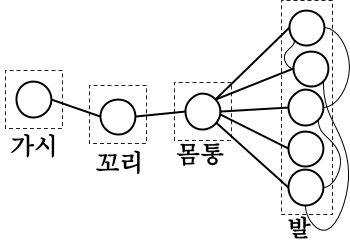
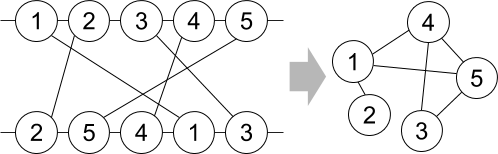

## 문제

컴퓨터 과학에서 사용하는 그래프, 그중에서도 간선에 방향성이 없는 무향 그래프를 상상해보자. 이 중 어떤 그래프들은 특수한 성질을 가지고 있다. 예를 들어,

* 어떤 무향 그래프는 ‘임의의 두 정점 쌍 간의 경로가 항상 존재하는’ 성질을 가진다. 이러한 그래프를 우리는 *연결 그래프*라고 부른다.
* 어떤 무향 그래프는, ‘사이클이 존재하지 않는’ 성질을 가진다. 이러한 그래프를 우리는 *포레스트*라고 부른다.
* 어떤 무향 그래프는, ‘사이클이 존재하지 않으며 모든 정점 쌍 간의 경로가 존재하는’ 성질을 가진다. 이러한 그래프를 우리는 *트리*라고 부른다.
* 어떤 무향 그래프는, ‘*전갈스러운*’ 성질을 가진다..? 이러한 그래프를 우리는 ***전갈 그래프***라고 부른다...?

|  |  |  |  |
| --- | --- | --- | --- |
|  |  |  |  |
| 연결 그래프 | 포레스트 | 트리 | 전갈 그래프 |

그래프의 예시

이번 문제에서 우리는 전갈 그래프를 다루게 될 것이다. 전갈스러운 성질을 가지는 그래프를 전갈 그래프라고 부르며, ‘전갈스러운 성질’은 다음과 같이 정의된다.

* 그래프는 연결 그래프이다.
* 모든 정점은 아래 4가지 종류 중 하나에 속한다.
  + ***가시*** 단 하나의 ‘가시’ 정점이 존재하여, 꼬리 정점과만 연결되어 있다.
  + ***꼬리*** 단 하나의 ‘꼬리’ 정점이 존재하여, 가시 정점과 몸통 정점과만 연결되어 있다.
  + ***몸통*** 단 하나의 ‘몸통’ 정점이 존재하여, 꼬리 정점과 모든 발 정점들과만 연결되어 있다.
  + ***발*** 가시, 꼬리, 몸통 정점 이외의 모든 정점은 ‘발’ 정점이다. 각각의 발 정점은 반드시 몸통 정점과 연결되어 있으며, 꼬리 정점과 가시 정점과는 연결되어 있지 않다. 발 정점끼리는, 연결되어 있을 수도 있고, 연결되어 있지 않을 수도 있다.

전갈 그래프의 예

왜 컴퓨터 과학자들은 ‘전갈스럽다’는 그래프 성질을 발견하고 이름까지 붙였을까? 이는 이 성질이 가지는 독특함 때문이다. *N* × *N* 크기의 인접 행렬이 주어졌을 때, 자명하지 않은 대부분의 그래프 성질(연결 그래프, 트리, 포레스트, ...)을 판별하는 데에는, 입력을 제외하면 *O*(*N*2)의 시간이 필요하다. 하지만, 놀랍게도 어떤 그래프의 ‘전갈성’은, 간선의 개수에 상관없이, 항상 입력 제외 *O*(*N*)의 시간에 판별할 수 있는 알고리즘이 존재한다.

재현이는 전갈 그래프의 이러한 놀라운 성질에 감탄하여서, 여러분에게 순열 그래프라는 또 하나의 독특한 그래프를 주고, 이 그래프가 전갈스러운지를 판단하는 문제를 출제하였다. 순열 그래프란 무엇일까? 길이가 *N*인 순열 *A1*, *A2*, · · · , *AN*에 대해, 순열 *A*로 나타낸 순열 그래프는 아래와 같이 정의된다.

* 그래프는 1부터 *N*까지의 번호가 붙은 *N*개의 정점으로 구성된다.
* 그래프의 간선은 아래와 같은 과정으로 잇는다.
  1. 두 개의 평행한 직선을 그려, 한 직선 위에는 1, 2, ··· , *N*을, 다른 직선 위에는 *A1*, *A2*, ··· , *AN*를 차례로 적는다.
  2. 같은 수끼리 선분을 잇는다.
  3. *i*끼리 이은 선분과 *j*끼리 이은 선분이 교차하는 모든 (*i*, *j*) 쌍에 대해, *i*번 정점과 *j*번 정점을 무방향 간선으로 연결한다.

*A* = [2, 5, 4, 1, 3]으로 나타낸 순열 그래프

문제를 조금 더 어렵게 만들고 싶었던 재현이는, *Q*개의, 순열의 두 수를 교환하는 연산을 추가했다. 당신은, 교환 연산 이후의 순열 그래프 각각에 대해서 그 그래프가 전갈성을 띄는지 판별해야 한다. 교환 연산은 일시적이지 않으며, 이후 연산에 영향을 끼친다.

## 입력

첫 번째 줄에 순열의 길이 *N* (4 ≤ *N* ≤ 100 000)이 주어진다.

두 번째 줄에 순열 *A*를 나타내는 서로 다른 *N*개의 자연수 *A1*, *A2*, ... , *AN* (1 ≤ *Ai* ≤ *N*)이 주어진다.

세 번째 줄에 교환 연산의 수 *Q* (1 ≤ *Q* ≤ 100 000)이 주어진다.

이후 *Q*개의 줄에는 교환 연산에 대한 정보가 주어진다. 각 줄에는 두 개의 자연수 *x*와 *y* (1 ≤ *x*, *y* ≤ *N*, *x* ≠ *y*)가 공백을 사이로 두고 주어지는데, 이는 순열 *A*의 *x*번째 원소 *Ax*와 *y*번째 원소 *Ay*의 값을 먼저 교환한 후, 순열 *A*로 나타낸 순열 그래프가 전갈 그래프인지 판별하여 출력하라는 의미이다.

## 출력

각 교환 연산이 주어질 때마다, 교환 이후 순열 *A*로 나타낸 순열 그래프가 전갈 그래프라면 “`YES`” (따옴표 제외)를, 그렇지 않다면 “`NO`” (따옴표 제외)를 각 줄에 하나씩 출력한다.
