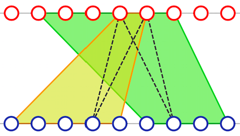

## 문제

경기과학고의 작곡동아리 ‘매나니’의 리더, 황동욱과 이상헌은, 오늘 Coder’s High 2016에서 끝내주는 공연을 보여주기 위해서 모든 것을 준비했다. 악기와 음향 장비 등, 모든 것이 그들의 노력과 넥슨지티의 후원으로 순조롭게 이루어졌지만, 사회자 황동욱의 무대 의상을 고르는 과정에서 위기가 찾아왔다. 과연 무슨 일이 일어났을까?

패션에 조금이라도 관심이 있다면, 나비넥타이의 정의는 모두 알고 있을 것이다. 이분 그래프가 있을 때, 크기 4의 단순 사이클을 “**나비넥타이**”라고 정의한다. 나비넥타이를 고르기 위해, 동욱이와 상헌이는 넥슨지티로부터 2*N*개의 정점이 있는 거대한 이분 그래프를 후원받았다.

이 이분 그래프는 *N*개의 정점이 천장에 매달려 있고, 나머지 *N*개의 정점이 바닥에 붙어있는 꼴로 생겨있다. 천장과 바닥에 있는 *N*개의 정점은 각각 1번부터 *N*번까지 번호가 매겨져 있다. 천장과 바닥은 *M*개의 사다리꼴로 이어지며, 각 사다리꼴은 천장에서 차지하는 구간 [*sx*, *ex*] 과, 바닥에서 차지하는 구간 [*sy*, *ey*]로 표현될 수 있다. 천장에 있는 점 *i*와 바닥에 있는 점 *j*는, 두 점을 잇는 직선을 "감싸는" (즉, *sx* ≤ *i* ≤ *ex*과 *sy* ≤ *j* ≤ *ey*를 모두 만족하는) 사다리꼴이 존재할 때, 에지로 연결되어 있다.

예제 2의 그래프와, 가능한 나비넥타이 하나

걱정이 많은 성격인 상헌이는, 가능한 모든 나비넥타이를 동욱이에게 시도해 보고, 가장 어울리는 것이 무엇인지를 결정하고 싶어한다. 하지만, 황동욱은 가능한 나비넥타이의 수가 너무 많기 때문에, 그것이 불가능할 것이라고 상헌이에게 말했다.

APIO 2016 금메달리스트인 황동욱은, 상헌이에게 나비넥타이의 수가 많다는 것을 보이기 위해서, 프로그램을 통해서 개수를 세어 주려고 시도했다. 그 때, 악당 구재현의 침투로, 동욱이와 상헌이의 노트북은 폭파되고, 그들은 은밀한 곳으로 납치당했다. 호기심이 많은 악당 구재현은, 그래프의 나비넥타이의 수를 세기 전까지는, 그들을 풀어주지 않을 계획이다.

남은 시간은 5시간 뿐이다. 여러분들은, 이분 그래프의 모양이 주어졌을 때, 가능한 나비넥타이의 경우가 무엇인지를 대신 세서, 악당 구재현의 방해 공작을 이겨내고, 그들의 공연이 성공적으로 이루어지게 도와야 한다. 나비넥타이가 *서로 다르다*는 것은, 나비 넥타이를 이루는 간선 집합에서, 다른 원소가 하나라도 존재한다는 것을 의미한다.

## 입력

첫 번째 줄에 *N* (1 ≤ *N* ≤ 109)과 *M* (0 ≤ *M* ≤ 1 000)이 공백을 사이로 두고 주어진다. 그래프의 정점이 2*N*개이며, *M*개의 사다리꼴이 존재함을 뜻한다.

이후 *M*개의 줄에, 사다리꼴이 *sx* *ex* *sy* *ey*의 형태로 주어진다. *sx* ≤ *i* ≤ *ex*과 *sy* ≤ *j* ≤ *ey*를 만족하는 모든 *i*-*j* 쌍에 대해 간선이 존재함을 뜻한다. (1 ≤ *sx* ≤ *ex* ≤ *N*, 1 ≤ *sy* ≤ *ey* ≤ *N*)

## 출력

그래프의 나비넥타이의 수를 109 + 7로 나눈 나머지를 출력한다.
