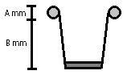

## 문제

찬우는 N개의 종이컵을 쌓아서 건축물을 만들려고 한다. 찬우는 삼각형 모양으로 종이컵을 쌓는 것은 너무 어렵다고 생각해서 위아래로 퍼진 일직선 형태로 만들려고 한다. 종이컵 1개는 아래 그림과 같은 형태이다.

찬우가 만약 이런 형태의 종이컵 6개를 ‘)(()))’모양으로 쌓는다면 아래 그림과 같은 형태가 될 것이다.

종이컵의 크기가 A=8, B=36으로 주어졌다면 위 건축물의 높이는 156mm이다.

찬우는 N개의 종이컵으로 만들 수 있는 건축물의 높이로 가능한 경우를 전부 알아보려고 한다. 찬우를 도와 만들 수 있는 건축물의 높이를 구하는 프로그램을 작성하여라.

## 입력

첫 번째 줄에 A, B, N이 주어진다. (1 ≤ A, B, N ≤ 1,000, 2A ≤ B)

## 출력

만들 수 있는 건축물의 높이로 가능한 값을 오름차순으로 출력한다.
