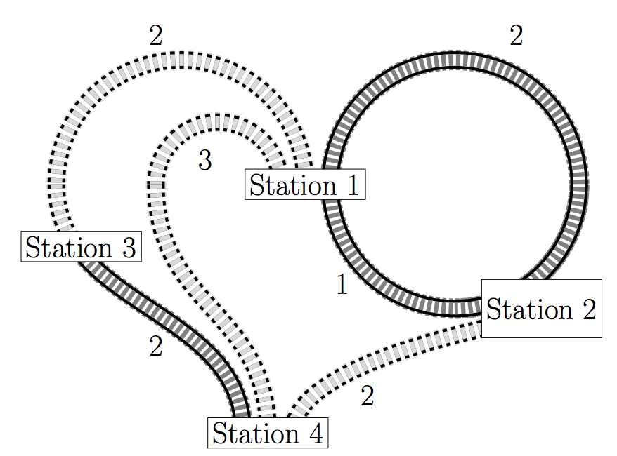
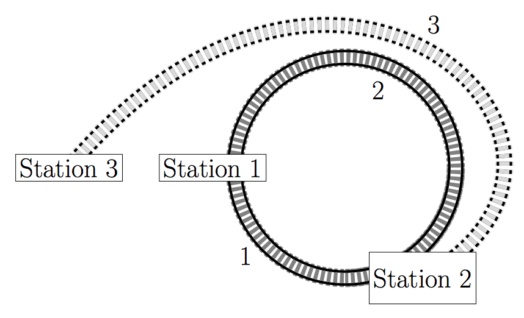

## 문제

Since childhood you have been fascinated by model railroads. Designing your own tracks, complicated intersections, train stations with miniatures of travellers, train operators, luggage is so much fun! However, it also needs a lot of space. Since your house is more than full by now, you decide to move to the garden.

You have already moved all your completed tracks outside when you notice an important flaw: Since different tracks were in different rooms before, there are stations which cannot be reached from each other. That has to change!

Since you have already fixed the exact positions of the stations, you know the lengths for all possible connections you can build and also which stations are connected already. All connections can be used in both directions. You can decide to remove some existing connections and instead build new ones of at most the same total length. Is it possible to rearrange the railroads so that every station is reachable from all other stations?

## 입력

The input consists of:

* one line with three integers n (2 ≤ n ≤ 5 · 104), m (0 ≤ m ≤ 2.5 · 105) and ℓ (0 ≤ ℓ ≤ m), where n is the number of stations, m is the number of possible connections and ℓ is the number of connections already built;
* m lines describing the connections. Each connection is described by:
  + one line with three integers a, b (1 ≤ a, b ≤ n), and c (0 ≤ c ≤ 5 · 103) describing that there is a connection from station a to station b of length c.

The first ℓ of those connections already exist.

## 출력

Output “possible” if it is possible to construct a connected network as described above, otherwise output “impossible”.

## 힌트

Figure E.1 depicts the first sample case. It is possible to connect all stations by removing the connections between stations 1 and 2 of length 2 and instead building the connection between stations 2 and 4. The curvature of the rails does not matter because you have a hammer.

In the second case, depicted in Figure E.2, it is not possible to connect all three stations.

Figure E.1: Illustration of the first sample input.

Figure E.2: Illustration of the second sample input.
