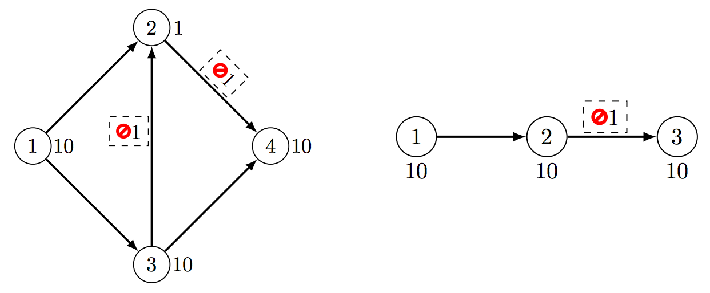

## 문제

As part of his new job at the IT security department of his company, Bob got the task to track how fast messages between the companies’ different offices are transmitted through the internet. Since some offices are currently rebuilt and not finished yet he is not able to simply measure the transmission speed but needs to compute it somehow. Therefore, Bob created a map of all servers that may be involved in routing the packages through the internet. He also gathered the times each server needs to process a message. The total processing time of a message is the sum of the processing times of the sender, all servers along the path, and the receiver. Furthermore, Bob read that messages are sent through the network of servers along a path such that the total processing time of all servers on the path is minimal.

Bob thought that it might be an easy problem to compute the total transmission time between two offices, but he forgot the intelligence agencies! Each server on the internet is controlled by some agency that can decide which packages are routed and which of them are not. All servers are configured in a way that they read all incoming data, since gathering all kind of information is exactly what the intelligence agencies want to do, but not all data is forwarded to other servers.

Each server has a list of pairs of other servers such that messages from the first of them are not sent to the second one. Can you still help Bob to compute how fast his messages will be transmitted?

## 입력

The input consists of:

* one line with an integer n (2 ≤ n ≤ 100), where n is the number of servers labeled from 1 to n;
* n blocks describing the servers. Each server is described by:
* one line with two integers m (0 ≤ m ≤ n − 1) and t (0 ≤ t ≤ 1000), where m is the number of outgoing connections from this server and t is the processing time of this server;
* m lines with two integers s (0 ≤ s ≤ n − 1) and x (1 ≤ x ≤ n) and s more distinct integers a1, . . . , as (1 ≤ aj ≤ n, aj ≠ i for all 1 ≤ j ≤ s) indicating that server i sends messages to server x, but only if it was not directly transmitted from one of the servers a1, . . . , as to server i.

Bob’s messages start at server 1 and should go to server n.

## 출력

Output the sum of the processing times of all servers on the shortest path for Bob’s message including the first and last one, or “impossible” if there is no such path.

## 힌트

Figure K.1: Illustration of the sample inputs.
