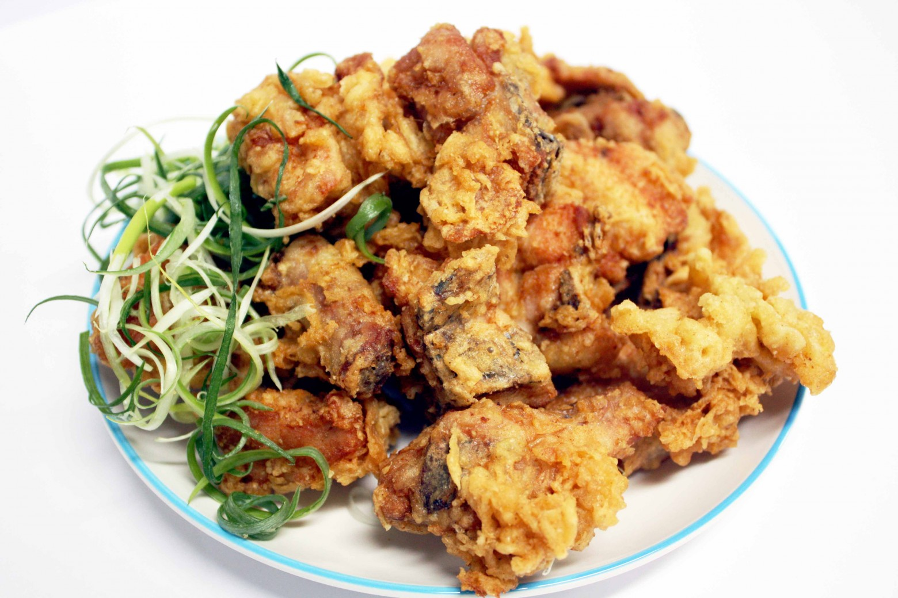

## 문제

서울대학교 301동에는 아는 사람만 아는 “눕치킨”이란 치킨집이 있다. 이 치킨집은 여느 치킨집처럼 치킨을 시킬 때 마다 쿠폰을 *C* 장 주고, 쿠폰을 *F* 장 모으면 치킨을 공짜로 시킬 수 있다.

눕치킨의 단골이 아닌 두영이에게는 쿠폰으로 시키는 치킨에는 쿠폰이 딸려나오지 않는다. 하지만 눕치킨의 단골 손님인 상언이에게는 치킨집 아저씨가 쿠폰으로 시키는 치킨에 쿠폰을 주신다. 상언이와 두영이는 둘 다 *M* 원을 가지고 있고, 치킨의 가격은 *P* 원이다. 이때, 상언이는 두영이보다 치킨을 얼마나 더 시켜먹을 수 있을까?

## 입력

첫 번째 줄에 테스트 케이스의 수 *T* (1 ≤ *T* ≤ 20,000)가 주어지고, 이어서 *T*개의 테스트 케이스가 주어진다.

각 테스트 케이스마다 한 줄에 4개의 정수가 주어진다. 이는 순서대로 치킨의 가격 *P* (1 ≤ *P* ≤ 50,000), 치킨에 쓸 돈 *M* (1 ≤ *M* ≤ 1,000,000), 치킨을 공짜로 시키는데 필요한 쿠폰의 장수 *F* (2 ≤ *F* ≤ 1,000), 치킨을 시키면 주는 쿠폰의 장수 *C* (1 ≤ *C* < *F*) 를 의미한다.

## 출력

각 테스트 케이스마다, 첫 번째 줄에 상언이가 두영이보다 더 먹을 수 있는 치킨의 수를 출력한다.
