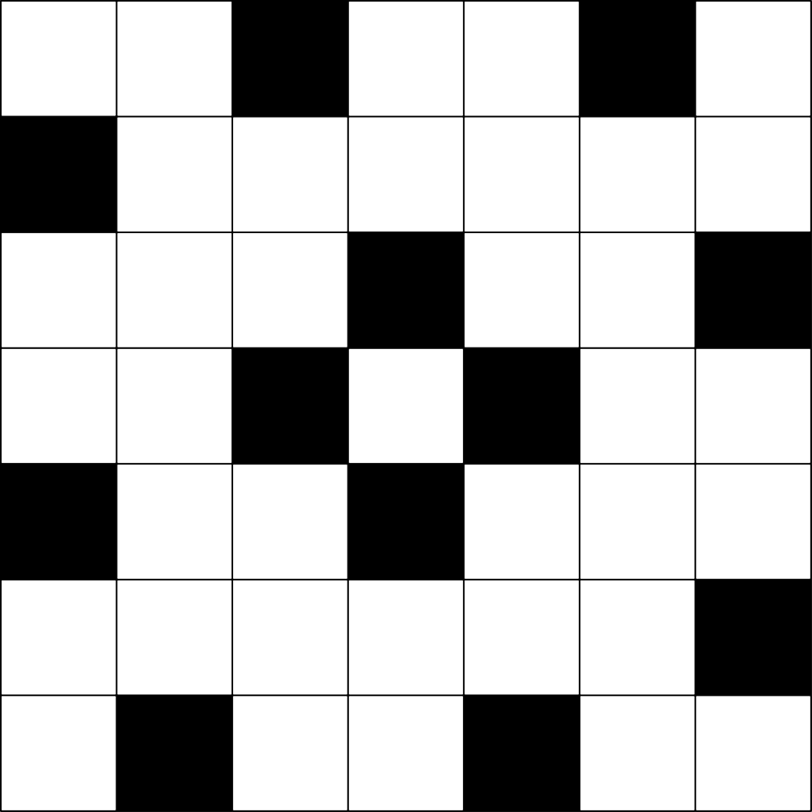
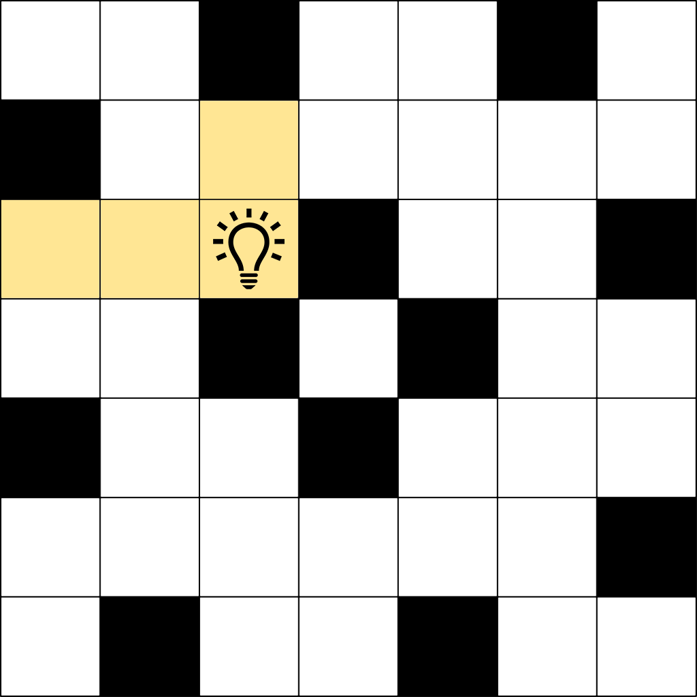
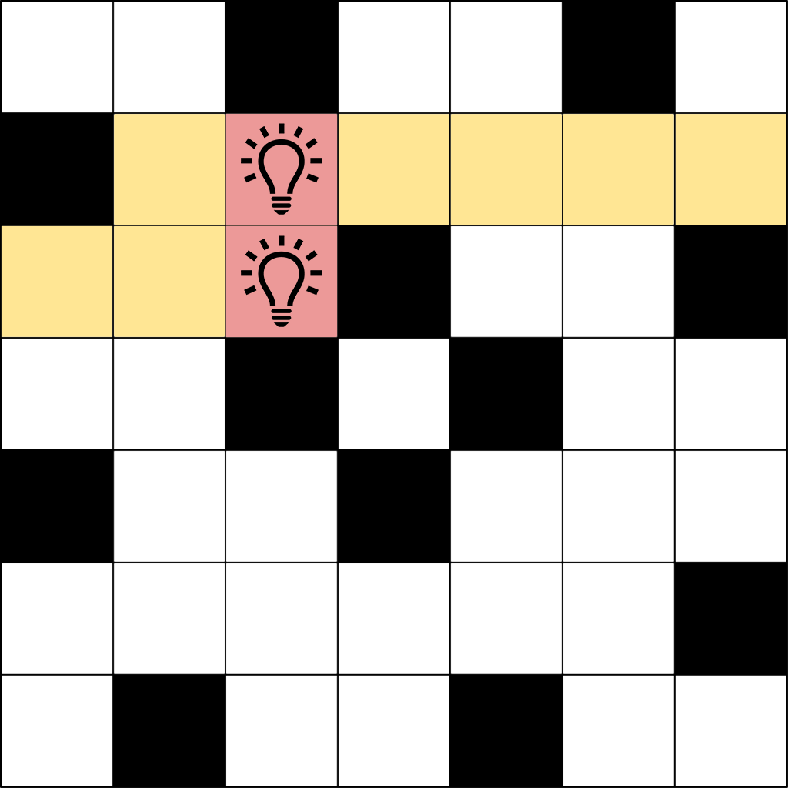
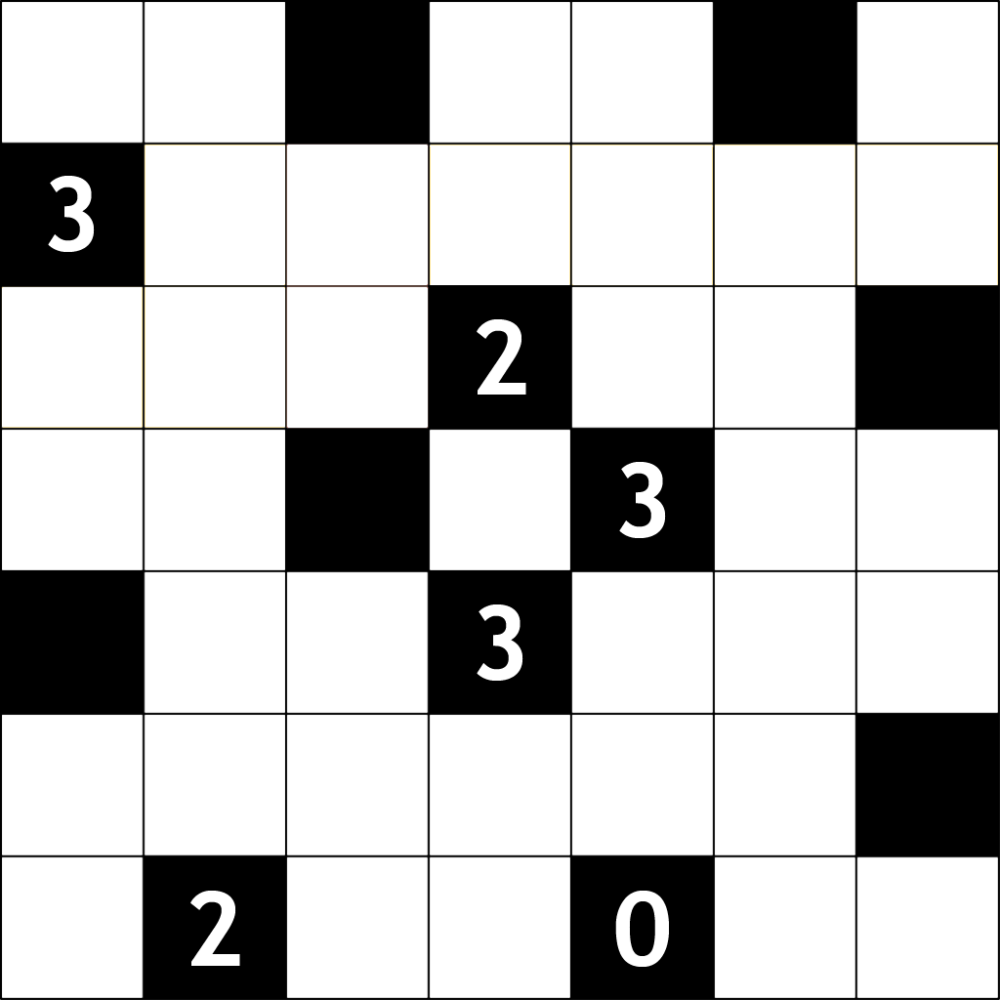
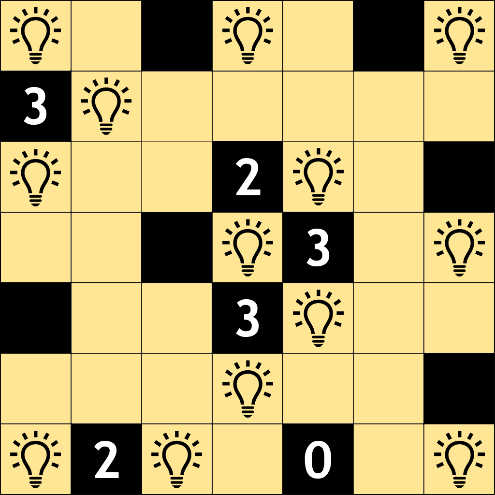

## 문제

[Light Up](./001_asset_1)은 온라인으로 할 수 있는 퍼즐 게임이다. 이 게임의 규칙은 간단하다. *N* × *N* 크기의 격자판이 주어지는데, 이 격자판의 각 칸은 검정색 정사각형 혹은 흰색 정사각형으로 구성되어 있다. 이 게임의 목표는 흰색 정사각형에 백열 전구를 아주 잘 놓아, 모든 흰색 정사각형에 불이 들어오게 하는 것이다. 만약 어떤 흰색 정사각형과 같은 세로줄 혹은 같은 가로줄에 백열 전구가 놓여 있고, 사이에 검정색 정사각형이 없다면 그 흰색 정사각형은 불이 켜진 상태가 된다.

<그림 1>

그림 1과 같은 격자판이 주어졌을 때, (3, 3)의 위치에 백열 전구를 배치하면 그림 2와 같은 상황이 된다.

<그림 2>

그런데 이미 불이 켜진 흰색 정사각형에 다른 백열 전구를 놓으면, 백열 전구가 과열되기 때문에 배치를 할 수 없게 된다. 즉, 그림 3 같이 (2, 3)과 (3, 3)에 백열 전구를 배치하는 것은 불가능하다.

<그림 3>

몇몇 검은 정사각형에는 숫자가 쓰여 있는데, 이는 그 정사각형과 변을 공유하는 네 개의 정사각형 중 백열 전구가 놓여있어야 하는 정사각형의 개수를 의미한다. 그림 4와 같은 상황을 살펴보자.

<그림 4>

그림 4와 같은 판이 주어졌을 때, 백열 전구를 잘 배치하는 방법은 그림 5와 같다.

<그림 5>

임의의 격자판이 주어졌을 때, 퍼즐을 해결하는 방법을 알아내자.

## 입력

첫 번째 줄에 테스트 케이스의 수 *T* 가 주어진다. (1 ≤ *T* ≤ 30)

테스트 케이스의 첫 번째 줄에 격자판의 크기 *N* 이 주어진다. (1 ≤ *N* ≤ 7)

테스트 케이스의 두 번째 줄부터 *N* 개의 줄에 걸쳐 *N* 개의 숫자가 주어진다. *i* 번째 줄의 *j* 번째 숫자는 격자판의 (*i*, *j*) 위치의 정사각형에 대한 정보 *Rij* 이다. *Rij* 가 −2인 경우 흰색 정사각형, *Rij* 가 −1인 경우 검은색 정사각형, 0이상 4이하인 경우 그 숫자가 적힌 검은색 정사각형이다.

## 출력

*N* 개의 줄에 걸쳐 각 줄에 0 또는 1인 *N* 개의 숫자를 출력한다. 퍼즐을 해결할 수 있도록 백열 전구를 배치한 후, 백열 전구가 배치된 칸은 1, 그렇지 않은 칸은 0으로 표현하여 출력한다.

답이 항상 존재하는 입력만 주어지고, 두 개 이상의 답이 존재하는 경우 그 중 하나만을 출력한다.
