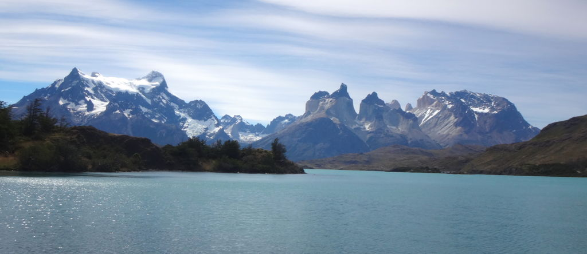
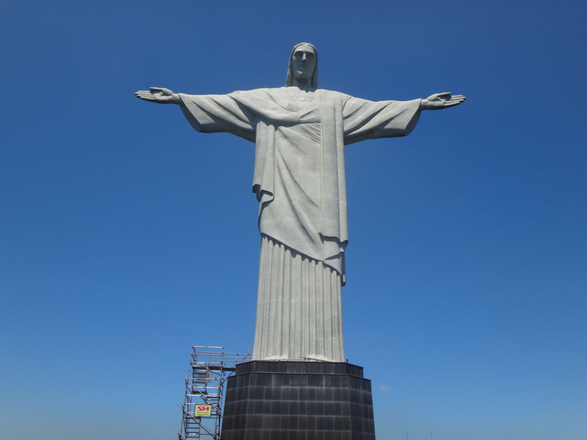
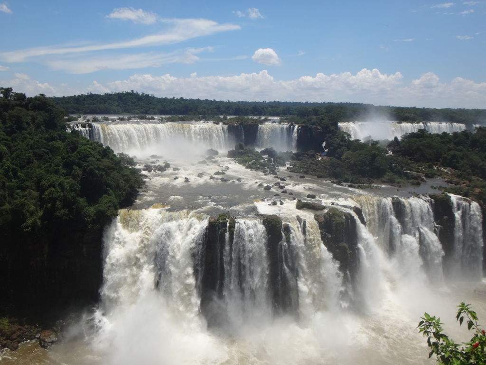
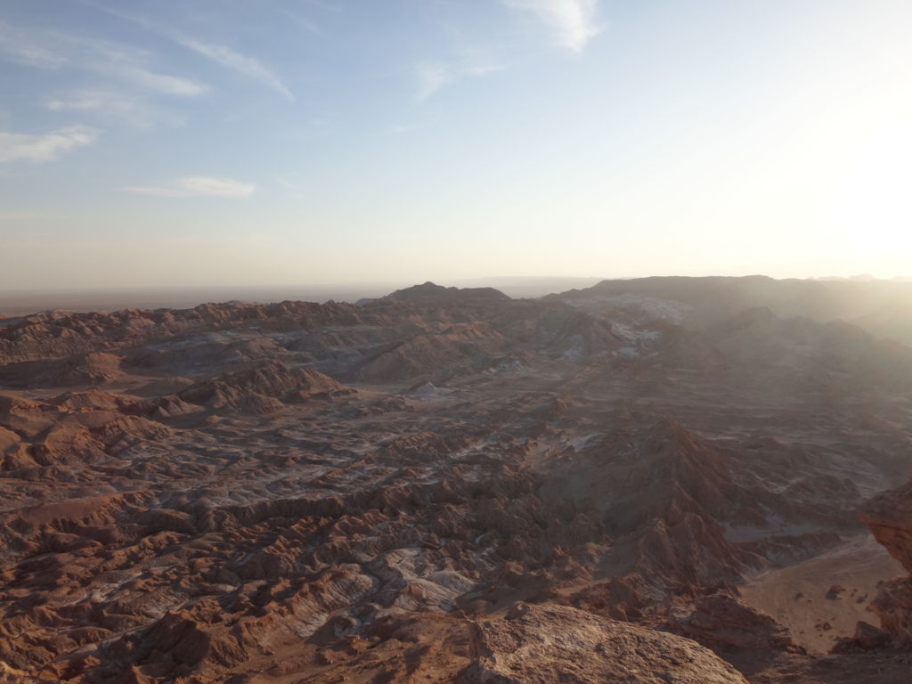
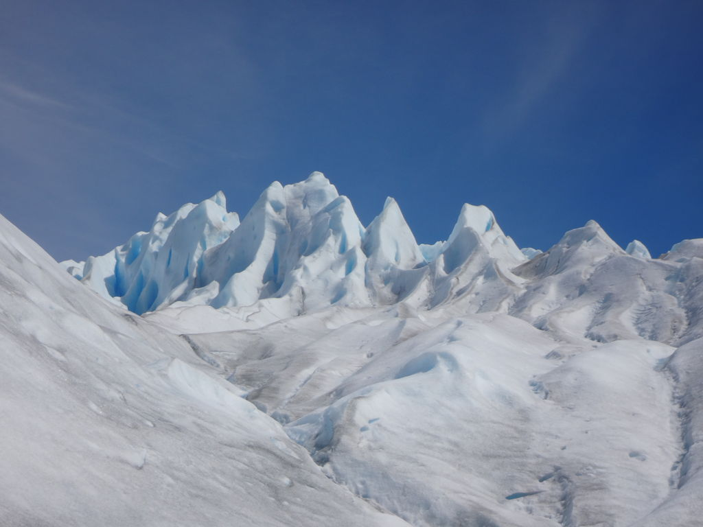
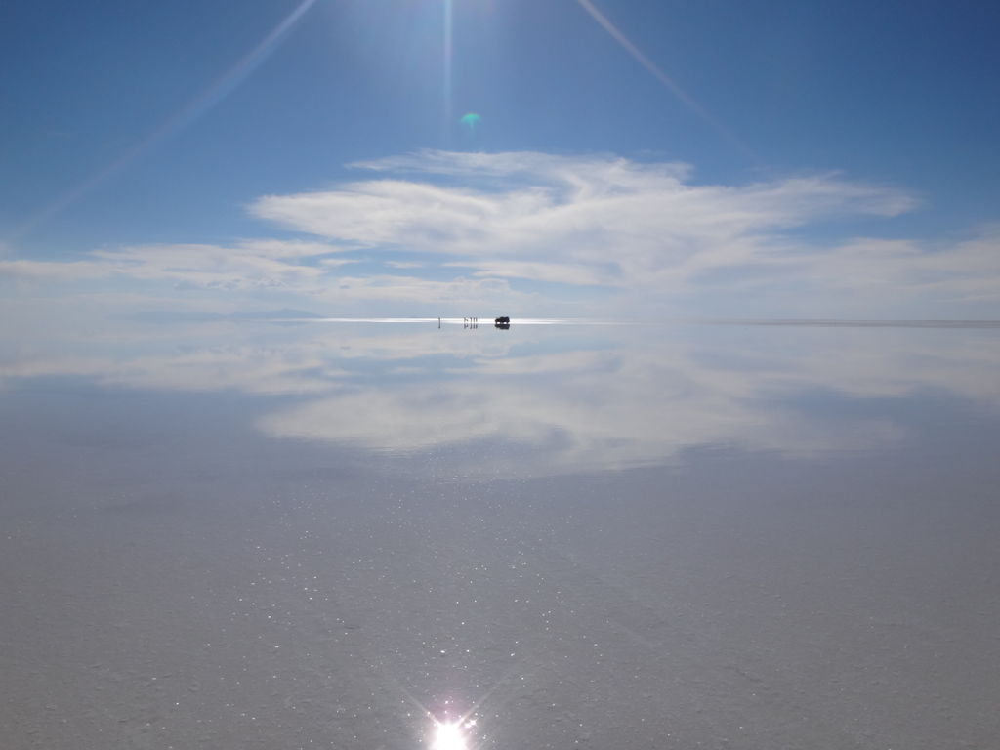
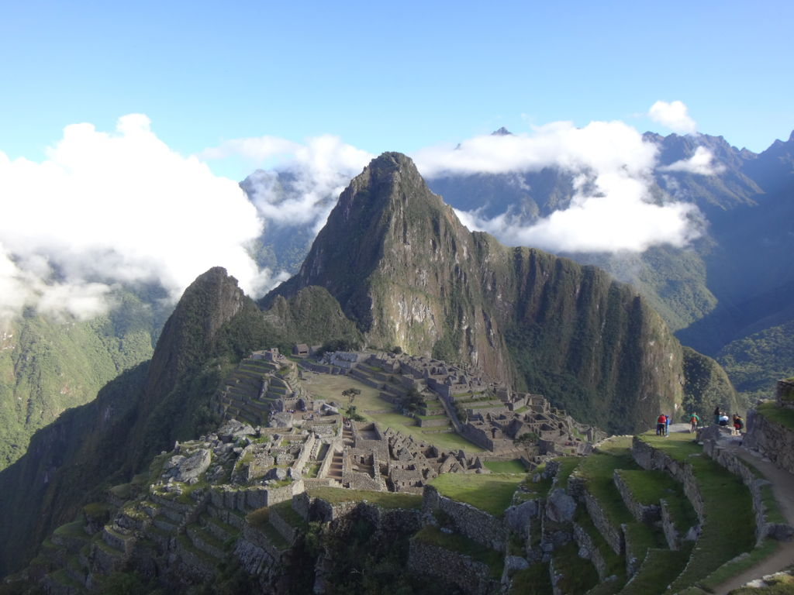

## 문제

남아메리카 대륙의 끝 파타고니아 지방에는 아름다운 풍경으로 유명한 토레스 델 파이네 국립공원이 있다. 거대한 산봉우리, 빙하와 호수, 숲과 강이 어우러진 절경을 보러 해마다 수많은 사람들이 찾는다. 이 곳을 제대로 감상하기 위한 방법으로 토레스 델 파이네를 W 모양으로 가로지르는 W 트레킹 코스가 있는데 약 3박 4일 정도 소요된다. 남아메리카 여행을 갔으나 일정 문제로 이 곳에 3박 4일 동안 있을 수 없었던 브라이언이 2020년에 다시 한 번 가보겠다고 하니 관심 있는 사람은 같이 여행하는 것도 좋을 것 같다. (광고 아님)

토레스 델 파이네에는 깎아지른듯한 세 개의 화강암 봉우리가 나란히 있는데, 높이가 2,800m에 달하고 각각의 이름은 Torre Norte(북쪽 봉우리), Torre Central(가운데 봉우리), Torre Sur(남쪽 봉우리)이다. 이 세 개의 봉우리는 완전히 일직선으로 놓여있지 않기 때문에 보는 위치에 따라 세 개의 봉우리가 보이는 순서는 바뀔 수 있다.

토레스 델 파이네를 구경하던 브라이언은, 공원 안에서 봉우리를 현재와 같은 순서로 볼 수 있는 지점이 얼마나 되는지 궁금해졌다. 공원의 전체 영역과 세 봉우리의 위치가 주어졌을 때, 세 봉우리를 순서대로 볼 수 있는 영역의 넓이를 구하는 프로그램을 작성해보자.

## 입력

첫 번째 줄에 테스트 케이스의 수 *T* 가 주어진다.

각 테스트 케이스는 두 줄로 이루어져 있다. 첫 번째 줄에는 실수 네 개가 주어지며, 이는 공원 영역을 나타낸다. 공원 영역은 직사각형이며, 왼쪽 아래 점의 좌표 *x0*, *y0* 와 오른쪽 위 점의 좌표 *x1*, *y1* 이 주어진다. (-109 ≤ *x0*, *y0*, *x1*, *y1* ≤ 109)

다음 줄에는 실수 여섯 개가 주어지며, 이는 세 개의 봉우리 A, B, C 의 좌표 *xa*, *ya*, *xb*, *yb*, *xc*, *yc*를 의미한다. 세 점은 모두 공원 영역 안에 위치해 있으며 (즉 *x0* < *xa*, *xb*, *xc* < *x1* 를 만족하고 *y0* < *ya*, *yb*, *yc* < *y1* 를 만족함) 세 점이 일직선상에 놓여있는 경우는 입력으로 주어지지 않는다.

## 출력

각 테스트 케이스마다 한 줄씩 공원 영역 안에서 봉우리가 순서대로 보이는 영역의 넓이를 출력한다. 출제진의 답과 절대 오차 또는 상대 오차가 10−6 이하일 시 정답으로 인정한다. 어떤 점에서 봉우리가 순서대로 보인다는 것은 해당 지점에서 시계방향으로 A, B, C 가 순서대로 보임을 의미한다.

## 힌트

아래 사진은 문제 풀이와 관련이 없습니다. 심심할 때 보세요.

Cristo Redentor

Iguazu Falls

Atacama Desert

Perito Moreno Glacier

Salar de Uyuni

Machu Picchu
