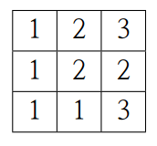
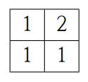

## 문제

*N* × *M* 크기의 격자판이 있다. 격자판의 각 칸은 1에서 *K* 사이의 숫자 하나가 적혀 있다. 편의상 *i*행 *j*열 (1 ≤ *i* ≤ *N*, 1 ≤ *j* ≤ *M*)의 격자를 (*i*, *j*)로 표시한다.

주어진 격자판 내에서 *k*종류의 숫자가 적혀 있는 크기가 *n* × *m*인 서로 다른 직사각형의 개수 *Ck*,*n*,*m* 을 모두 구하는 프로그램을 작성하라. 여기서 직사각형은 1 ≤ *x1* ≤ *x2* ≤ *N*, 1 ≤ *y1* ≤ *y2* ≤ *M* 를 만족하는 네 개의 정수 *x1*, *y1*, *x2*, *y2* 에 의해 결정되며, *x1* ≤ *x* ≤ *x2* 와 *y1* ≤ *y* ≤ *y2* 를 만족하는 모든 격자 (*x*, *y*)를 일컫는다. 이 직사각형의 크기는 (*x2* − *x1* + 1) × (*y2* − *y1* + 1)이 된다.

예를 들어 *N* = *M* = *K* = 3일 때, 다음과 같이 숫자가 적혀 있다고 하자.

*x1* = 2, *y1* = 1, *x2* = 3, *y2* = 2라면, 4개의 격자 (2, 1), (2, 2), (3, 1), (3, 2)가 모두 한 직사각형에 속한다. 이 직사각형만 떼어 적으면 다음과 같다.

이 직사각형에는 1 혹은 2밖에 없으므로 두 종류의 수가 쓰인 직사각형이다. 두 직사각형이 서로 다르다는 것은 [*x1*, *y1*, *x2*, *y2*]가 서로 다르다는 것이다.

## 입력

주의 : 이 문제의 입력은 하나의 테스트 케이스로 구성되어 있다.

첫 번째 줄에 세 정수 *N*, *M*, *K* (1 ≤ *N*, *M* ≤ 512, 1 ≤ *K* ≤ 9)가 공백으로 구분되어 주어진다.

두 번째 줄부터 *N* 개의 줄에 걸쳐 격자판의 각 칸에 적힌 숫자를 의미하는 *M* 개의 숫자가 공백 없이 주어진다. 각 숫자는 1에서 *K* 사이의 숫자이다.

## 출력

모든 *C* 값을 출력하기에는 시간이 너무 오래 걸리기 때문에, 첫 번째 줄에 다음의 값을 1, 000, 000, 007로 나눈 나머지를 출력한다.

\[\prod\_{k=1}^{K}\prod\_{n=1}^{N}\prod\_{m=1}^{M} (C\_{k, n, m} + k \times n \times m)\]
