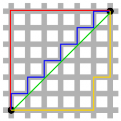

## 문제

The island of Manhattan in New York has a grid-like network of streets, where taxis have to travel in a rectilinear fashion along the north, south, east and west cardinal directions. The distance from one intersection to another is often called the taxicab distance or manhattan distance. This form of geometry was first considered by Hermann Minkowski in 19th century Germany.

Suppose Manhattan is a 100km x 100km grid of streets with street blocks measuring 1km x 1km. If someone was waiting for a taxi at the (x,y) intersection of (0,0) and the only taxi in Manhattan is at an (x,y) intersection of (100,100), the manhattan distance between them is 200km. Vice versa, if the person is waiting at the (x,y) intersection of (100,100) and the taxi was at (0,0), the manhattan distance would still be 200km.

Of course there are hundreds of taxis in Manhattan. Output the closest taxi to the intersection you are waiting at in Manhattan.

## 입력

The first line of the input will be the (x,y) intersection that you are waiting at for a taxi. The second line has a single integer N (1<=N<=100) of the number of available taxis in Manhattan. The next N lines will be the (x,y) positions of taxis around Manhattan. Taxis will always be at the intersections of streets and there will only be one taxi per intersection. All taxis will be at different manhattan distances from you.

## 출력

The position of the closest taxi to you.
