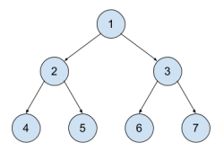
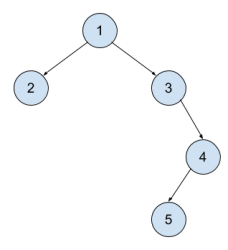

## 문제

A binary tree is a mathematical structure made of nodes where each node can have up to two children nodes. One child node will be called left child and the other right child. ch If node B is a child node of A, then we say that A is the parent node of B. In a binary tree, there is only one node that has no parent and we call this node the root of the tree. We call the height of a node  N to the distance in nodes between the node N and the root node. The root node’s height is 0.

In this problem, you’ll have to compute the heights of every node of the tree. Each node will be identified by an integer from 1 to the number of nodes n.

Check the following tree:

The root of the tree is 1. The left child of 1 is 2, the right child of 1 is 3.

The nodes 4, 5, 6 and 7 do not have any child.

The heights of the nodes are:

* Node 1: 0
* Nodes 2 and 3: 1
* Nodes 4, 5, 6 and 7: 2

The following tree is a bit different:

Node 1 is still the root and has 2 and 3 as left and right children but 3 only have right child. On the contrary, node 4 only has left child (5).

The heights:

* Node 1: 0
* Nodes 2 and 3: 1
* Node 4: 2
* Node 5: 3

## 입력

The first line of the input will contain the number of nodes n. (1 ≤ n ≤ 20)

The following n lines will contain one integer each representing the parent of a node. That is, the second line of the input will contain the parent of node 1, the third line the parent of node 2, etc.

The root node will be identified by -1. Remember that node 1 won’t always be the root node.

## 출력

Print n lines. The first line should be the height of node 1, the second should be the height of node 2, and so on.
