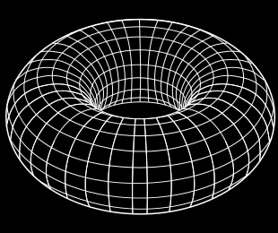

## 문제

상근이는 도넛해를 항해하고 있다. 도넛해는 토러스 모양이며, N × M개의 칸으로 나누어져 있으며, 아래 그림처럼 생겼다.

(Image by YassineMrabet from Wikimedia Commons, licensed under CC BY-SA 3.0.)

도넛해의 모든 칸은 좌표 (n, m)으로 나타낼 수 있다. (0 ≤ n < N, 0 ≤ m < M)

모든 좌표는 N과 M으로 나눈 나머지 값을 가져야 한다. 즉, (N-1, M-1) 칸이 좌표의 범위에 포함되지 않는다면, (N-2, M-1), (0, M-1), (N-1, M-2), (N-1, 0) 중 하나로 이동했을 것이다.

상근이는 (0, 0)에서 출발해서 (x, y)에 도착하려고 한다.

상근이가 이동할 수 있는 방법은 두 좌표를 1씩 증가시키거나, 1씩 감소시키는 것이다. 즉, 상근이가 (n, m)에 있다면, 이동할 수 있는 칸은 ((n+1)%N, (m+1)%M) 또는 ((n-1)%N, (m-1)%M) 이다. 두 칸으로 이동할 확률은 같으며, 이동에는 하루가 걸린다.

상근이가 (x, y)에 도착하는데 필요한 일의 기댓값을 구하는 프로그램을 작성하시오.

## 입력

첫째 줄에 N, M, x, y가 주어진다. (2 ≤ N, M ≤ 10, 0 ≤ x ≤ N-1, 0 ≤ y ≤ M-1)

(x, y)는 (0, 0)이 아니다.

## 출력

첫째 줄에 (x, y)에 도착하는데 필요한 일의 기댓값을 출력한다. 정답과의 절대/상대 오차는 10-9까지 허용한다. 만약, (x, y)로 이동할 수 없다면 -1을 출력한다.
